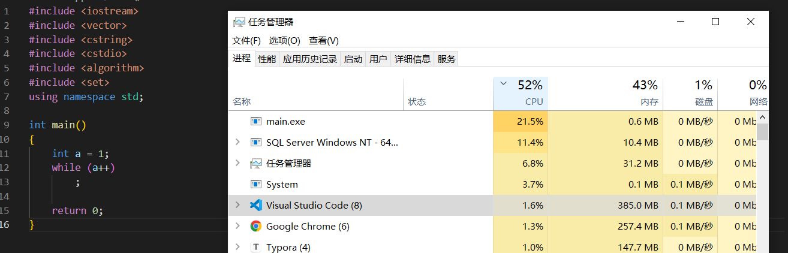

### CPU负载和CPU利用率的区别是什么? 如果CPU负载很高，利用率却很低该怎么办? 如果负载很低，利用率却很高呢? 如果CPU使用率达到100%呢?怎么排查?

CPU利用率:显示的是程序在运行期间实时占用的CPU百分比

CPU负载:显示的是一段时间内正在使用和等待使用CPU的平均任务数。CPU利用率高，并不意味着负载就一定大。

但似乎高利用率或者高负载只是个现象，由用户行为导致

