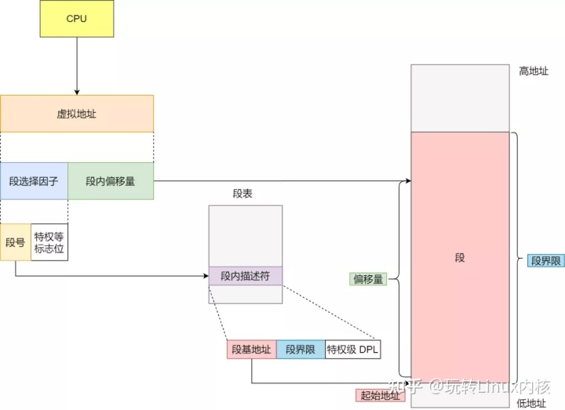
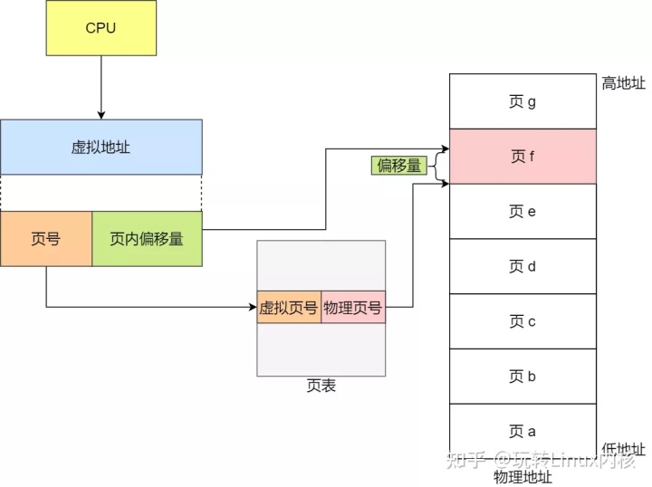

### 讲讲分页、分段机制

虚拟内存映射到物理内存有几种方式

注意下面的图都是硬件实现的

##### 段式：

好处是在物理地址中连续

缺点是物理内存比较难管理，容易产生碎片

##### 页式：

好处是物理空间会比较好管理

缺点是物理空间并不连续，有些特殊需求(比如DMA)导致操作系统仍需要控制物理内存的分配，同时可能会有页内碎片无法利用。

页式大部分场景下远优于段式，所以现在的mmu都是用的页表。

段这一概念还是比较常见的，比如ELF文件中的段表，可执行文件装载的时候就需要这么一个分类控制控制权限的东西，只是没必要耦合到内存映射这一步去。