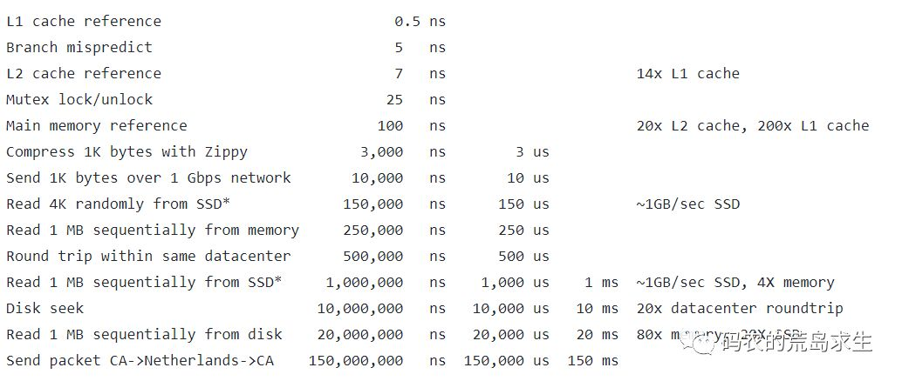
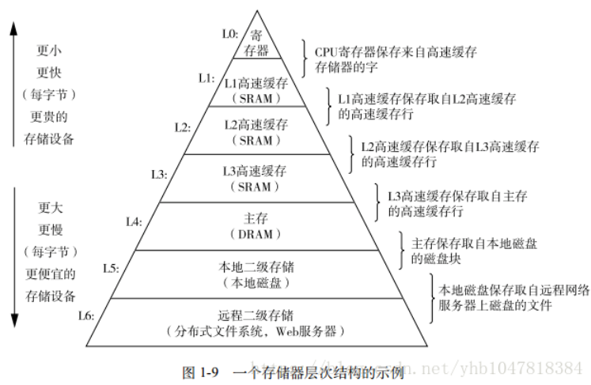
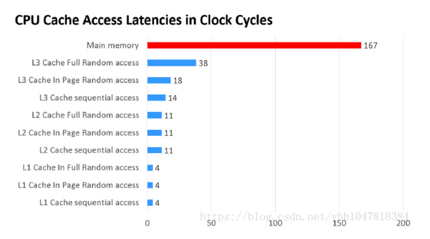

## **什么是Cache?**

Cache Memory也被称为Cache，是存储器子系统的组成部分，存放着程序经常使用的指令和数据，这就是Cache的传统定义。从广义的角度上看，Cache是快设备为了缓解访问慢设备延时的预留的Buffer，从而可以在掩盖访问延时的同时，尽可能地提高数据传输率。 快和慢是一个相对概念，与微架构(Microarchitecture)中的 L1/L2/L3 Cache相比， DDR内存是一个慢速设备；在磁盘 I/O 系统中，DDR却是快速设备，在磁盘 I/O 系统中，仍在使用DDR内存作为磁介质的Cache。在一个微架构中，除了有L1/L2/L3 Cache之外，用于虚实地址转换的各级TLB， MOB( Memory Ordering Buffers)、在指令流水线中的ROB，Register File和BTB等等也是一种Cache。我们这里的Cache，是狭义 Cache，是CPU流水线和主存储器的 L1/L2/L3 Cache。

## **Cache在哪里呢？**

也许很多人会不假思索的说：“在CPU内核里。”Not so fast！它也有可能在主板上！我们先来了解一下Cache的历史。

- PC-AT/XT和286时代：没有Cache，CPU和内存都很慢，CPU直接访问内存。
- 386时代：CPU速度开始和内存速度不匹配了。为了能够加速内存访问，芯片组增加了对快速内存的支持，这也是在电脑上第一次出现Cache（尽管IBM 360 model系统上已经出现很久了），也是L1（一级Cache）的雏形。这个Cache是可选的，低端主板并没有它，从而性能受到很大影响。而高级主板则带有64KB，甚至高端大气上档次的128KB Cache，在当时也是可以笑傲江湖了。当时的Cache都是Write-Through，即Cache内容的更新都会立刻写回内存中。
- 486时代：Intel在CPU里面加入了8KB的L1 Cache，当时也叫做内部Cache。它在当时是Unified Cache，就是不分代码和数据，都存在一起。原先在386上面的Cache，变成了L2，也被叫做外部Cache。大小从128KB到256KB不等。这时增加了Write-back的Cache属性，即Cache内容更改后不立刻更新内存，而是在Cache miss的时候再更新，避免了不必要的更新。
- 586/Pentium-1时代：L1 Cache被一分为二，分为Code和data，各自8KB。这是因为code和data的更新策略并不相同，而且因为CISC的变长指令，code cache要做特殊优化。与此同时L2还被放在主板上。后期Intel推出了[Pentium Pro](https://link.zhihu.com/?target=http%3A//en.wikipedia.org/wiki/Pentium_Pro) ('80686')，L2被放入到CPU的Package上
- 奔腾4/奔腾D：L2被放入到了Die里面。这就和现在的L1和L2很相像了，问题来了，多内核呢？第一代奔腾D双核中，L1和L2被两个Die各自占据。Netburst的Pentium 4 Extreme Edition高端版甚至加入L3。但在后期与HT一起随着Netburst架构被放弃。
- Core/Core2：巨大的变化发生在L2，L2变成多核共享模式
- 现在：L3被加入到CPU Die中，它在逻辑上是共享模式。而L2则被每个Core单独占据。这时L2也常被指做**MLC**（Middle Level Cache），而L3也被叫做**LLC**（Last Level Cache）
- Haswell/Broadwell:在Iris系列中，一块高速DRAM被放入Package中，叫做eDRAM。
- 它在平时可以做显存。也可以被设定为L4缓存

访问L2 cache的时延大概是访问L1 cache的10几倍左右，而访问一次内存的时延则高达访问L2 cache的20倍，**是访问L1cache耗时的200倍**。

分支预测失败的惩罚大概只有5ns这个量级

L3 Cache和L1，L2 Cache有着本质的区别。，L1和L2 Cache都是每个CPU core独立拥有一个，而L3 Cache是几个Cores共享的，可以认为是一个更小但是更快的内存。

一级缓存制造成本很高因此它的容量有限，二级缓存的作用就是存储那些CPU处理时需要用到、一级缓存又无法存储的数据。
同样道理，三级缓存和内存可以看作是二级缓存的缓冲器，它们的容量递增，但单位制造成本却递减。