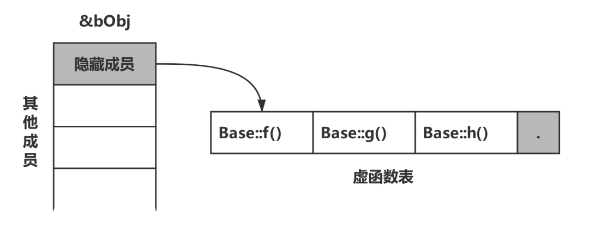

C++中的虚函数实现了多态的机制，也就是用父类型指针指向其子类的实例，然后通过父类的指针调用实际子类的成员函数，这种技术可以让父类的指针有“多种形态”，这也是一种泛型技术，也就是使用不变的代码来实现可变的算法

每个对象占用存储空间的只是该对象的数据部分（虚函数指针和虚基类指针也属于数据部分），函数代码属于公用部分

我们常说的“A对象的成员函数”，是从逻辑的角度而言的，而成员函数的物理存储方式其实不是如此

静态成员函数和非静态成员函数都是在类的定义时放在内存的代码区的，因而可以说它们都是属于类的，但是类为什么只能直接调用静态类成员函数，而非静态类成员函数(即使函数没有参数)只有类对象才能调用呢

原因是：类的非静态类成员函数其实都内含了一个指向类对象的指针型参数(即this指针)，因此只有类对象才能调用(此时this指针有实值)

## **函数表**

C++通过继承和虚函数来实现多态性，虚函数是通过一张虚函数表实现的，虚函数表解决了继承、覆盖、添加虚函数的问题，保证其真实反应实际的函数

### **函数表原理简述**

C++实现虚函数的方法是：为每个类对象添加一个隐藏成员，隐藏成员保存了一个指针，这个指针叫虚表指针（vptr），它指向一个虚函数表（virtual function table, vtbl）

虚函数表就像一个数组，表中有许多的槽（slot），每个槽中存放的是一个虚函数的地址（可以理解为数组里存放着指向每个虚函数的指针）

即：每个类使用一个虚函数表，每个类对象用一个虚表指针

在有虚函数的类的实例对象中，这个表被分配在了这个实例对象的内存中（就和上面说的一样），当我们用父类的指针来操作一个子类的时候，这张表就像一个地图一样，指明了实际所应该调用的函数

在上面这个图中，虚函数表的最后多加了一个结点，这是虚函数表的结束结点，就像字符串的结束符/0一样，其标志了虚函数表的结束，这个结束标志的值在不同的编译器下可能是不同的

基类对象包含一个虚表指针，指向基类的虚函数表

派生类对象也将包含一个虚表指针，指向派生类虚函数表

如果派生类重写了基类的虚方法，该派生类虚函数表将保存重写的虚函数的地址，而不是基类的虚函数地址

如果基类中的虚方法没有在派生类中重写，那么派生类将继承基类中的虚方法，而且派生类中虚函数表将保存基类中未被重写的虚函数的地址，但如果派生类中定义了新的虚方法，则该虚函数的地址也将被添加到派生类虚函数表中

当子类重新定义了父类的虚函数后，当父类的指针指向子类对象的地址时，[即B b; A a = &b;] 父类指针根据赋给它的不同子类指针，动态的调用子类的该函数，而不是父类的函数，且这样的函数调用发生在运行阶段，而不是发生在编译阶段，称为动态联编。而函数的重载可以认为是多态，只不过是静态的。注意，非虚函数静态联编，效率要比虚函数高，但是不具备动态联编能力。

基类定义了虚函数，子类可以重写该函数，当子类重新定义了父类的虚函数后，父类指针根据赋给它的不同的子类指针，动态地调用属于子类的该函数，且这样的函数调用是无法在编译器期间确认的，而是在运行期确认，也叫做迟绑定。

虚函数是 C++ 实现**动态单分派子类型多态**（dynamic single-dispatch subtype polymorphism）的方式。

- 动态：在运行时决定的（相对的是静态，即在编译期决定，如函数重载、模板类的非虚函数调用）
- 单分派：基于一个类型去选择调用哪个函数（相对于多分派，即由多个类型去选择调用哪个函数）
- 子类型多态：以子类型－超类型关系实现多态（相对于用参数形式，如函数重载、模版参数）