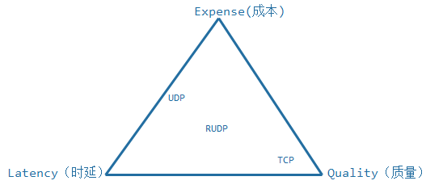
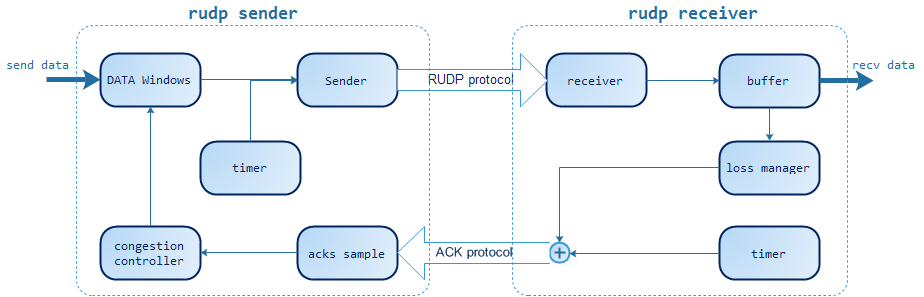
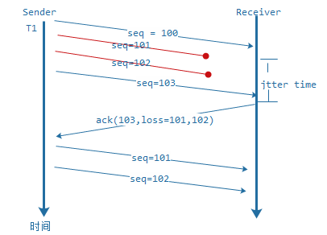
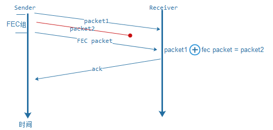

RUDP 在很多著名的项目上都有使用，例如 Google 的 QUIC 和 webRTC。

投入的成本、获得的质量和通信的时延之间是一个三角制约 (LEQ) 关系，所以实时通信系统的设计者会在这三个制约条件下找到一个平衡点，TCP 属于通过增大延迟和传输成本来保证质量的通信方式，UDP 是通过牺牲质量来保证时延和成本的通信方式，所以在一些特定场景下 RUDP 更容易找到这样的平衡点。

## 可靠的概念

在实时通信过程中，不同的需求场景对可靠的需求是不一样的，我们在这里总体归纳为三类定义：

- **尽力可靠**：通信的接收方要求发送方的数据尽量完整到达，但业务本身的数据是可以允许缺失的。例如：音视频数据、幂等性状态数据。
- **无序可靠**：通信的接收方要求发送方的数据必须完整到达，但可以不管到达先后顺序。例如：文件传输、白板书写、图形实时绘制数据、日志型追加数据等。
- **有序可靠**：通信接收方要求发送方的数据必须按顺序完整到达。

## UDP 为什么要可靠

说到这里可能很多人会说：干嘛那么麻烦，**直接用 TCP 好了！** 确实很多人也都是这样做的，TCP 是个基于公平性的可靠通信协议，但是在一些苛刻的网络条件下 TCP 要么不能提供正常的通信质量保证，要么成本过高。为什么要在 UDP 之上做可靠保证，究其原因就是在保证通信的时延和质量的条件下尽量降低成本，RUDP 主要解决以下相关问题：

- **端对端连通性问题**：一般终端直接和终端通信都会涉及到 NAT 穿越，TCP 在 NAT 穿越实现非常困难，相对来说 UDP 穿越 NAT 却简单很多，如果是端到端的可靠通信一般用 RUDP 方式来解决，场景有：端到端的文件传输、音视频传输、交互指令传输等等。
- **弱网环境传输问题**：在一些 Wi-Fi 或者 3G/4G 移动网下，需要做低延迟可靠通信，如果用 TCP 通信延迟可能会非常大，这会影响用户体验。例如：实时的操作类网游通信、语音对话、多方白板书写等，这些场景可以采用特殊的 RUDP 方式来解决这类问题。
- **带宽竞争问题**：有时候客户端数据上传需要突破本身 TCP 公平性的限制来达到高速低延时和稳定，也就是说要用特殊的流控算法来压榨客户端上传带宽，例如：直播音视频推流，这类场景用 RUDP 来实现不仅能压榨带宽，也能更好地增加通信的稳定性，避免类似 TCP 的频繁断开重连。
- **传输路径优化问题**：在一些对延时要求很高的场景下，会用应用层 relay 的方式来做传输路由优化，也就是动态智能选路，这时双方采用 RUDP 方式来传输，中间的延迟进行 relay 选路优化延时。还有一类基于传输吞吐量的场景，例如：服务与服务之间数据分发、数据备份等，这类场景一般会采用多点并联 relay 来提高传输的速度，也是要建立在 RUDP 上的（这两点在后面着重来描述）。
- **资源优化问题**：某些场景为了避免 TCP 的三次握手和四次挥手的过程，会采用 RUDP 来优化资源的占用率和响应时间，提高系统的并发能力，例如 QUIC。

在 UDP 之上怎么实现可靠呢？**答案就是重传**。

## 重传模式

IP 协议在设计的时候就不是为了数据可靠到达而设计的，所以 UDP 要保证可靠，就依赖于重传，这也就是我们通常意义上的 RUDP 行为，在描述 RUDP 重传之前先来了解下 RUDP 基本框架，如图：

RUDP 分为发送端和接收端，每一种 RUDP 在设计的时候会做不一样的选择和精简，概括起来就是图中的单元。RUDP 的重传是发送端通过接收端 ACK 的丢包信息反馈来进行数据重传，发送端会根据场景来设计自己的重传方式，重传方式分为三类：定时重传、请求重传和 FEC 选择重传。

### 定时重传

定时重传很好理解，就是发送端如果在发出数据包（T1）时刻一个 RTO 之后还未收到这个数据包的 ACK 消息，那么发送端就重传这个数据包。这种方式依赖于接收端的 ACK 和 RTO，容易产生误判，主要有两种情况：

- 对方收到了数据包，但是 ACK 发送途中丢失。
- ACK 在途中，但是发送端的时间已经超过了一个 RTO。

所以超时重传的方式主要集中在 RTO 的计算上，如果你的场景是一个对延迟敏感但对流量成本要求不高的场景，就可以将 RTO 的计算设计得比较小，这样能尽最大可能保证你的延时足够小。

例如：实时操作类网游、教育领域的书写同步，是典型的用 expense 换 latency 和 quality 的场景，适合用于小带宽低延迟传输。如果是大带宽实时传输，定时重传对带宽的消耗是很大的，极端情况会有 20% 的重传率，所以在大带宽模式下一般会采用请求重传模式。

### 请求重传

请求重传就是接收端在发送 ACK 的时候携带自己丢失报文的信息反馈，发送端接收到 ACK 信息时根据丢包反馈进行报文重传。如下图：

这个反馈过程最关键的步骤就是回送 ACK 的时候应该携带哪些丢失报文的信息，因为 UDP 在网络传输过程中会乱序会抖动，接收端在通信的过程中要评估网络的 jitter time，也就是 rtt_var（RTT 方差值），当发现丢包的时候记录一个时刻 t1，当 t1 + rtt_var < curr_t(当前时刻)，我们就认为它丢失了。

这个时候后续的 ACK 就需要携带这个丢包信息并更新丢包时刻 t2，后续持续扫描丢包队列，如果 t2 + RTO <curr_t，则再次在 ACK 携带这个丢包信息，以此类推，直到收到报文为止。

这种方式是由丢包请求引起的重发，如果网络很不好，接收端会不断发起重传请求，造成发送端不停的重传，引起网络风暴，通信质量会下降，所以我们在发送端设计一个拥塞控制模块来限流，这个后面我们重点分析。

整个请求重传机制依赖于 jitter time 和 RTO 这个两个时间参数，评估和调整这两个参数和对应的传输场景也息息相关。请求重传这种方式比定时重传方式的延迟会大，一般适合于带宽较大的传输场景，例如：视频、文件传输、数据同步等。

### FEC 选择重传

除了定时重传和请求重传模式以外，还有一种方式就是以 FEC 分组方式选择重传，FEC（Forward Error Correction）是一种前向纠错技术，一般通过 XOR 类似的算法来实现，也有多层的 EC 算法和 raptor 涌泉码技术，其实是一个解方程的过程。应用到 RUDP 上示意图如下：

在发送方发送报文的时候，会根据 FEC 方式把几个报文进行 FEC 分组，通过 XOR 的方式得到若干个冗余包，然后一起发往接收端，如果接收端发现丢包但能通过 FEC 分组算法还原，就不向发送端请求重传，如果分组内包是不能进行 FEC 恢复的，就向发送端请求原始的数据包。

FEC 分组方式适合解决要求延时敏感且随机丢包的传输场景，在一个带宽不是很充裕的传输条件下，FEC 会增加多余的包，可能会使得网络更加不好。FEC 方式不仅可以配合请求重传模式，也可以配合定时重传模式。

