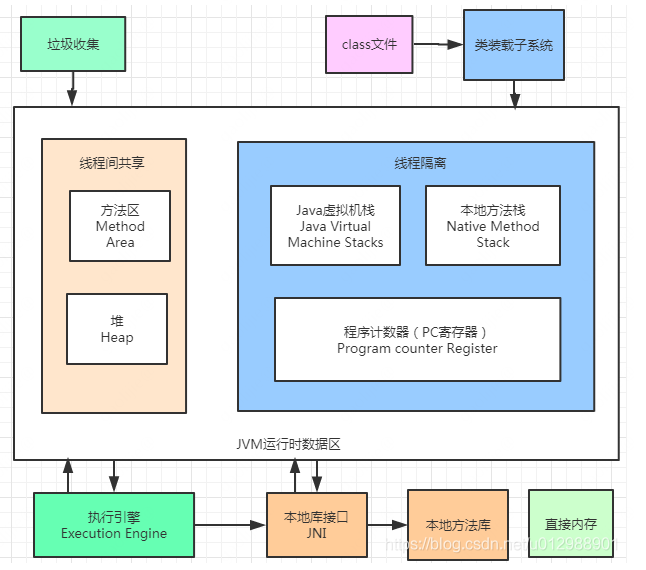
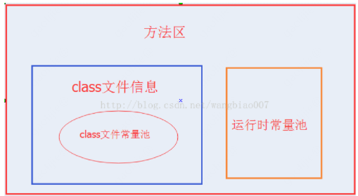

### Java: 说说JVM的内存布局？

JVM内存模型

线程隔离

- 程序计数器(PC寄存器)

- Java虚拟机栈
- 本地方法栈

线程间共享

- 方法区
- 堆

#### 程序计数器(线程独有的)

- 程序计数器是一块较小的内存空间，可以做为当前线程所执行的字节码的行号指示器。
- 字节码解释器在工作的时候，是通过改变这个计数器的值来选取下一条需要执行的字节码指令，他是程序控制流的指示器，分支、循环、跳转、异常处理、线程回复等基础功能都需要依赖这个计时器来完成。
- 每一条线程都有一个独立的程序计数器，各个线程和计数器间互不影响，独立存储，称这类内存区域为"线程私有"的内存。

#### Java虚拟机栈(线程独有的)【虚拟机使用的Java方法】

- 线程私有的，生命周期与线程一样。
- 虚拟机栈描述的是Java方法执行的线程内存模型：每个方法执行的时候，Java虚拟机栈都会同步创建**一个栈帧用于存储局部变量表、操作数栈、动态连接、方法返回地址等信息**。每个方法被调用直到执行完毕的过程，就对应一个栈帧从入栈到出栈的过程。
- 如果线程请求的栈深度大于虚拟机所允许的深度，将抛出StackOverflowError异常，如果Java虚拟机栈容量可以动态扩展，当栈扩展的时候，无法申请到足够的内存会抛出OutOfMemoryError异常。

#### 本地方法栈(线程独有的)【虚拟机使用到的本地方法】

- 本地方法栈(Native Method Stacks)：与虚拟机栈所发挥的作用很相似，区别在于**虚拟机栈为虚拟机执行Java方法(字节码)服务**，而**本地方法栈则是为虚拟机使用到的本地(Native)方法服务**。
- 与虚拟机栈一样：本地方法栈也会因为在栈深度溢出或者栈扩展失败的时候抛出：StackOverflowError和OutOfMemoryError异常。

#### Java堆(所有线程共享)

- Java堆：用于存储对象实例。Java堆被所有的线程共享的内存区域，在虚拟机启动时创建。
- Java堆是垃圾收集器管理的主要区域，很多时候被称为GC堆(Grabage Collected Heap)。
- 从内存回收的角度看，由于现在收集器基本上都采用分代收集，所以可以细分为新生代老年代。
- Java堆可以处于物理上不连续的内存空间中，只要逻辑上连续即可。

#### 方法区(所有线程共享)

- 方法区：用于存储
  - 已经被虚拟机加载数据：例如类型信息、常量、静态变量、即时编译器编译后的代码缓存等数据。
  - 运行时常量池。
- 别名为非堆区，区别于Java堆区。
- Java虚拟机规范对方法区的限制很宽松，除了和Java堆一样不需要连续的内存和可以选择固定大小或者可扩展外，还可以选择不实现垃圾回收。
- 当方法区无法满足内存分配需求时，将抛出OutOfMemoryError异常。

##### 虚拟机加载的数据

- 包含类型信息、常量、静态变量、即时编译器编译后的代码缓存等数据。

##### 运行时常量池

- 运行时常量池也是方法区的一部分
- 运行时常量池用于存放编译器产生的各种字面量和符号引用，这部分将在类加载后进入方法区的运行时常量池存放。
- 当常量池无法申请到内存时，将抛出OutOfMemoryError异常

ref:《深入理解Java虚拟机》