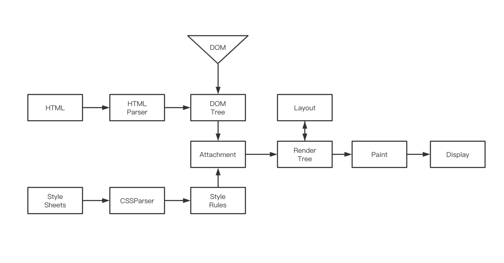

浏览器从输入网址到渲染页面主要分为以下几个过程

URL 输入
DNS 解析
建立 TCP 连接
发送 HTTP / HTTPS 请求（建立 TLS 连接）
服务器响应请求
浏览器解析渲染页面
HTTP 请求结束，断开 TCP 连接

URL地址 

URL（统一资源定位符，Uniform Resource Locator）用于定位互联网上资源，俗称网址。

我们在地址栏输入 HZFE 官方网址 hzfe.org 后敲下回车，浏览器会对输入的信息进行以下判断：

1. 检查输入的内容是否是一个合法的 URL 链接。
2. 是，则判断输入的 URL 是否完整。如果不完整，浏览器可能会对域进行猜测，补全前缀或者后缀。
3. 否，将输入内容作为搜索条件，使用用户设置的默认搜索引擎来进行搜索。

大部分浏览器会从历史记录、书签等地方开始查找我们输入的网址，并给出智能提示。

DNS（Domain Name System）解析
因为浏览器不能直接通过域名找到对应的服务器 IP 地址，所以需要进行 DNS 解析，查找到对应的 IP 地址进行访问。

DNS 解析 

1. 在浏览器中输入 hzfe.org 域名，操作系统检查浏览器缓存和本地的 hosts 文件中，是否有这个网址记录，有则从记录里面找到对应的 IP 地址，完成域名解析。
2. 查找本地 DNS 解析器缓存中，是否有这个网址记录，有则从记录里面找到对应的 IP 地址，完成域名解析。
3. 使用 TCP/IP 参数中设置的 DNS 服务器进行查询。如果要查询的域名包含在本地配置区域资源中，则返回解析结果，完成域名解析。
4. 检查本地 DNS 服务器是否缓存该网址记录，有则返回解析结果，完成域名解析。
5. 本地 DNS 服务器发送查询报文至根 DNS 服务器，根 DNS 服务器收到请求后，用顶级域 DNS 服务器地址进行响应。
6. 本地 DNS 服务器发送查询报文至顶级域 DNS 服务器。顶级域 DNS 服务器收到请求后，用权威 DNS 服务器地址进行响应。
7. 本地 DNS 服务器发送查询报文至权威 DNS 服务器，权威 DNS 服务器收到请求后，用 hzfe.org 的 IP 地址进行响应，完成域名解析。

查询通常遵循以上流程，从请求主机到本地 DNS 服务器的查询是递归查询，DNS 服务器获取到所需映射的查询过程是迭代查询。

### **建立 TCP 连接**

当浏览器获取到服务器的 IP 地址后，浏览器会用一个随机的端口（1024 < 端口 < 65535）向服务器 80 端口发起 TCP 连接请求（注：HTTP 默认约定 80 端口，HTTPS 为 443 端口）。这个连接请求到达服务端后，通过 TCP 三次握手，建立 TCP 的连接

### **服务器响应**

当浏览器到 web 服务器的连接建立后，浏览器会发送一个初始的 HTTP GET 请求，请求目标通常是一个 HTML 文件。服务器收到请求后，将发回一个 HTTP 响应报文，内容包括相关响应头和 HTML 正文。

#### **状态码**

状态码是由 3 位数组成，第一个数字定义了响应的类别，且有五类可能取值

- 1xx：指示信息——表示请求已接收，继续处理
- 2xx：成功——表示请求已被成功接收、理解、接受
- 3xx：重定向——要完成请求必须进行更进一步的操作
- 4xx：客户端错误——请求有语法错误或请求无法实现
- 5xx：服务器端错误——服务器未能实现合法的请求

### **浏览器解析并绘制**

不同的浏览器引擎渲染过程都不太一样，这里以 Chrome 浏览器渲染方式为例。

1. 处理 HTML 标记并构建 DOM 树。
2. 处理 CSS 标记并构建 CSSOM 树。
3. 将 DOM 与 CSSOM 合并成一个渲染树。
4. 根据渲染树来布局，以计算每个节点的几何信息。
5. 将各个节点绘制到屏幕上。

### **TCP 断开连接**

现在的页面为了优化请求的耗时，默认都会开启持久连接（keep-alive），那么一个 TCP 连接确切关闭的时机，是这个 tab 标签页关闭的时候。这个关闭的过程就是**四次挥手**。关闭是一个全双工的过程，发包的顺序是不一定的。一般来说是客户端主动发起的关闭.