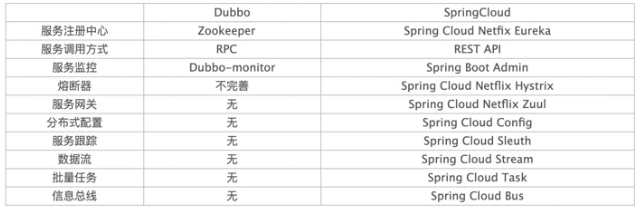

### Spring Cloud与Dubbo对比

区别：

- Dubbo底层是使用Netty的NIO框架，基于TCP协议传输，配合Hession序列化完成RPC通信。Dubbo主要分为服务注册中心、服务提供者、服务消费者、管控中心。
- SpringCloud是基于HTTP协议+rest接口调用远程过程的通信，HTTP报文更大，带宽占用更多。但是REST比RPC更加灵活，服务方和调用方只基于协议约定，不存在代码依赖，适用于微服务环境。SpringCloud则是完整的分布式架构，有服务注册中心、服务提供者、服务消费者、管控中心、断路器、分布式配置服务、消息总线、消息追踪等。

ref:https://segmentfault.com/a/1190000023675354