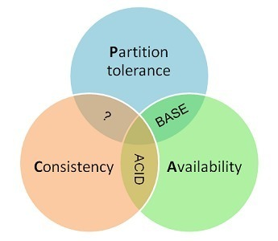

- 什么是数据库理论中的CAP原理。 Redis属于根据CAP原理分为的三大类里面的哪一类？ 传统数据库如Mysql属于哪一类？

CAP即**一个分布式系统最多只能同时满足一致性（Consistency）、可用性（Availability）和分区容错性（Partition tolerance）这三项中的两项**。

## **Consistency 一致性**

一致性指“`all nodes see the same data at the same time`”，即所有节点在同一时间的数据完全一致。

对于一致性，可以分为强/弱/最终一致性三类

从客户端角度，多进程并发访问时，更新过的数据在不同进程如何获取的不同策略，决定了不同的一致性。

- 强一致性

对于关系型数据库，要求更新过的数据能被后续的访问都能看到，这是强一致性。

- 弱一致性

如果能容忍后续的部分或者全部访问不到，则是弱一致性。

- 最终一致性

如果经过一段时间后要求能访问到更新后的数据，则是最终一致性。

## **Availability 可用性**

可用性指“`Reads and writes always succeed`”，即服务在正常响应时间内一直可用。

好的可用性主要是指系统能够很好的为用户服务，不出现用户操作失败或者访问超时等用户体验不好的情况。可用性通常情况下可用性和分布式数据冗余，负载均衡等有着很大的关联。

## **Partition Tolerance分区容错性**

分区容错性指“`the system continues to operate despite arbitrary message loss or failure of part of the system`”，即分布式系统在遇到某节点或网络分区故障的时候，仍然能够对外提供满足一致性或可用性的服务。

CA without P：如果不要求P（不允许分区），则C（强一致性）和A（可用性）是可以保证的。但其实分区不是你想不想的问题，而是始终会存在，因此CA的系统更多的是允许分区后各子系统依然保持CA。
CP without A：如果不要求A（可用），相当于每个请求都需要在Server之间强一致，而P（分区）会导致同步时间无限延长，如此CP也是可以保证的。很多传统的数据库分布式事务都属于这种模式。
AP wihtout C：要高可用并允许分区，则需放弃一致性。一旦分区发生，节点之间可能会失去联系，为了高可用，每个节点只能用本地数据提供服务，而这样会导致全局数据的不一致性。现在众多的NoSQL都属于此类。

Redis 是AP

MySql是CP