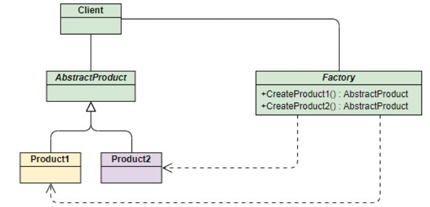

### 什么是工厂模式？

创建模式，用于生产对象，依据产品是具体产品还是具体工厂，分为简单工厂模式和工厂方法模式，根据工厂抽象程度可以分为工厂方法模式和抽象工厂模式。是一种创建型模式。

1、简单工厂模式

封装一层工厂方法。

简单工厂模式存在一系列问题：

- 工厂类中集中实例生产模式，这个工厂不能工作则都受到影响。
- 违背“开放-关闭原则”，添加新产品都需要修改工厂类。
- 简单工厂模式由于使用了静态工厂方法，静态方法不能被继承或者重写，会造成工厂角色无法形成基于继承的等级结构

2、工厂方法模式

工厂方法将生产具体产品的任务分发给具体的产品。

定义一个抽象工程，定义了产品的生存接口，不负责具体的产品，将生产任务交给不同的派生类工厂。不需要指定类型创建对象。

作用：将类的实例化延迟到工厂类的具体工厂中完成，即由子类来决定应该实例化哪一个类。解决简单工厂违背的开闭原则

缺点：新增产品需要提供具体工厂类。每个工厂只能创建一类产品。

3、抽象工厂模式

抽象工厂模式通过在AbstarctFactory中增加创建产品的接口，并在具体子工厂中实现新加产品的创建，当然前提是子工厂支持生产该产品。

解决的问题：每个工厂只能创建一类产品（即工厂方法模式的缺点）

优点：抽象工厂模式将具体产品的创建延迟到具体工厂的子类中，这样将对象的创建封装起来，可以减少客户端与具体产品类之间的依赖，从而使系统耦合度低，这样更有利于后期的维护和扩展。

缺点：抽象工厂模式很难支持新种类产品的变化。