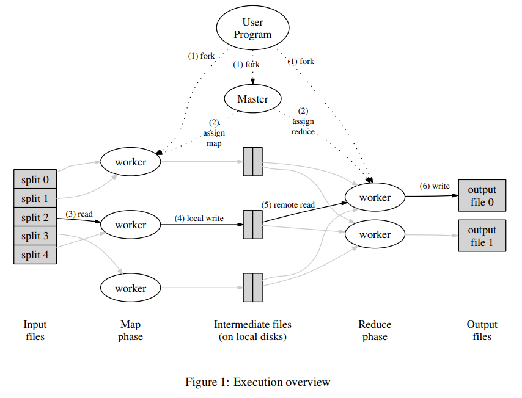

google文件系统是一个适用于有着大量数据的数据密集型应用的文件系统。它提供了在低成本硬件设备上的运行的容错功能，以及可以在大量客户端面前呈现出高的整体性能。

它与传统文件系统的的区别在于

- 分布式 - 提供很高的横向扩展性
- 使用大量廉价的普通机器组成网络 - 允许单机故障
- 不允许任意更改已有文件 (No Random Write)

实现方法上使用 master + chunkserver。

#### 1.2.1 存入

master 负责找到有空余位置的 chunkserver，同时根据文件大小将文件分成固定大小的 chunk. master 指示相关的 chunkserver存入给定的 chunk，并索引保存。chunkserver 直接与客户端联系获得相应的 chunk.

#### 1.2.2 读取

Master 负责接受客户端读取请求，通过内部的索引找到请求相关的每一个 chunk 的位置，并发送读取请求到每一个相关的 chunkserver. chunkserver 负责直接将文件回传给用户。master 在整个读写过程中并不承担文件传输的责任，而是只编制索引和实施检索，这样很大程度上避免了 master 成为 single point of failure。

### 其他功能

- 一定倍数的备份来防止机器故障
- 空间回收 - 删除的文件留出的空位可以再次使用
- 读写优化 - 分散文件及备份到多台机器来加速读写

## Big Table

Google 出品的数据库。

Big Table 的作用是在满足扩展性前提下存储海量数据，解决 SQL 数据库的扩展性短板。 它与传统的 SQL 数据库有很多本质的不同：

- 更简单的数据模型 - 使用 row key，column key 和时间来检索
- 不支持 SQL Query 的全部操作，比如没有 JOIN 操作
- 底层实现形式完全不同

#### Row Key

Row key 在实际存储中是按照字母顺序排列，每一段 row key 的区间作为一个Tablet。在分布式存储中，一个 Tablet 作为一个单位进行分布存储。

#### Column Key

Column Key 被组织成 Column Family，这个 family name 会作为每个 key 的前缀，形式上为 family:qualifier。

这样设计的好处。

- 每个 Row Key 可以存大量的 Column，并且不用事先设计好
- 不需要填满每个 Row 的每个 Column
- Column 查询速度快

总结起来说就是牺牲了空间（表格比较 Sparse 以及因为没有 JOIN 造成的一定程度的 denormalization)，换取了存储内容的灵活性和查询速度。

## MapReduce

MapReduce 作用是标准化大数据的处理和生成的模型，将其简化成 Map 和 Reduce两个流程，让使用者可以仅仅利用很简单的接口就实现大规模的分布式计算。

- User Program 开启一台服务器 Master 并且将文件分成数个 Split。
- Master 开启多台 Mapper 和 Reducer。
- Mapper 读取 Split 内数据并且进行用户定义的 Map 操作，该操作产生的中间数据会定期备份到硬盘并告知 Master 其位置。
- 当 Mapper 完成任务，Reducer 会通过 Master 得知这些的中间数据的位置，然后排序并进行 Reduce 操作。