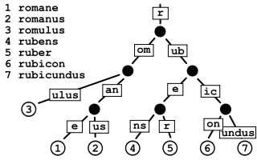

在计算机科学中，radix tree(也被称为radix trie，或者compact prefix tree)用于表示一种`空间优化的trie`(prefix tree)数据结构。 假如树中的一个节点是父节点的唯一子节点(the only child)的话，那么该子节点将会与父节点进行合并，这样就使得radix tree中的每一个内部节点最多拥有`r`个孩子， `r`为正整数且等于`2^n`(n>=1)。不像是一般的trie树，radix tree的边沿(edges)可以是一个或者多个元素。参看如下：

[](https://ivanzz1001.github.io/records/assets/img/data_structure/ds_radix_tree.png)

在radix tree的wiki中说到如下场景也很适合使用此数据结构来存储：

```
This makes radix trees much more efficient for small sets (especially if the strings are long) and
for sets of strings that share long prefixes.

即元素个数不是太多，但是元素之间通常有很长的相同前缀时很适合采用radix tree来存储
```

不像是平常的树结构（在进行key的比较时，是整个key从头到尾进行比较），radix key在每个节点进行key的比较时是以`bit组`(chunk-of-bits)为单位来进行的，每一个chunk中的bit数目等于`radix tree`的基数`r`。