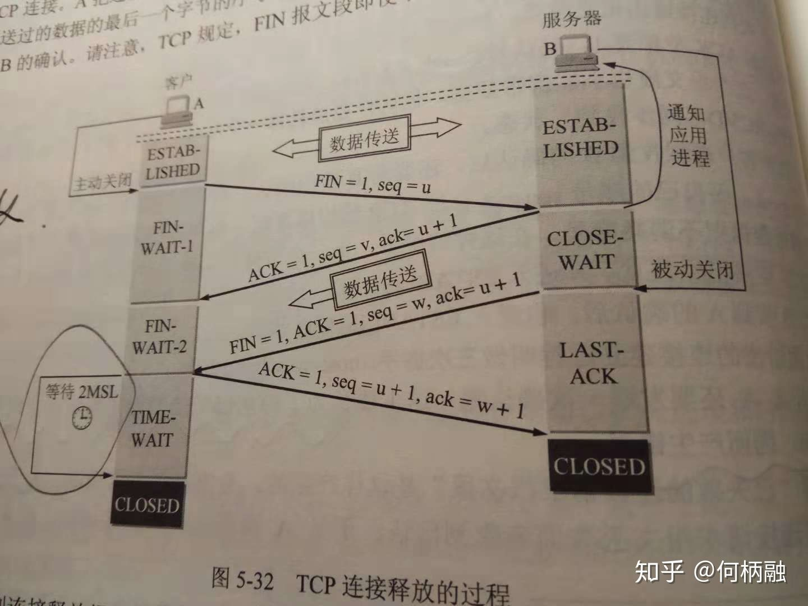

## 20220808

- 什么是 TIME_WAIT 状态，为什么需要 TIME_WAIT 状态？时间是多久，为什么？

time-wait开始的时间为tcp四次挥手中主动关闭连接方发送完最后一次挥手，也就是ACK=1的信号结束后，主动关闭连接方所处的状态。

time-wait的的持续时间为2MSL. MSL是Maximum Segment Lifetime,译为“报文最大生存时间”，可为30s，1min或2min。2msl就是2倍的这个时间。工程上为2min，2msl就是4min。但一般根据实际的网络情况进行确定。RFC规定为120s，但是Linux硬编码为60s

原因1：为了保证客户端发送的最后一个ack报文段能够到达服务器。因为这最后一个ack确认包可能会丢失，然后服务器就会超时重传第三次挥手的fin信息报，然后客户端再重传一次第四次挥手的ack报文。如果没有这2msl，客户端发送完最后一个ack数据报后直接关闭连接，那么就接收不到服务器超时重传的fin信息报(**此处应该是客户端收到一个非法的报文段，而返回一个RST的数据报，表明拒绝此次通信，然后双方就产生异常，而不是收不到。**)，那么服务器就不能按正常步骤进入close状态。那么就会耗费服务器的资源。当网络中存在大量的timewait状态，那么服务器的压力可想而知。

原因2: 在第四次挥手后，经过2msl的时间足以让本次连接产生的所有报文段都从网络中消失，这样下一次新的连接中就肯定不会出现旧连接的报文段了

旧 TCP 连接的被动关闭一方，由于没有收到第四次挥手报文，超时重发 FIN 报文。但此时主动打开的一方已经关闭连接，上一个连接的端口已经被用于建立新的 TCP 连接中，这样会莫名其妙收到一个 FIN 报文，产生混乱。