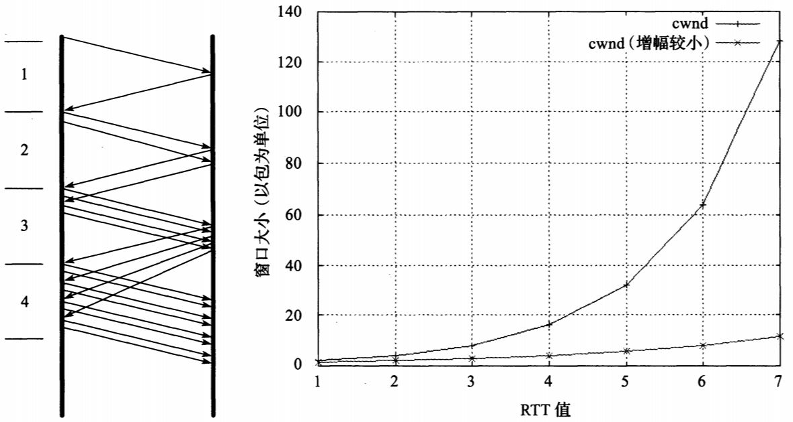
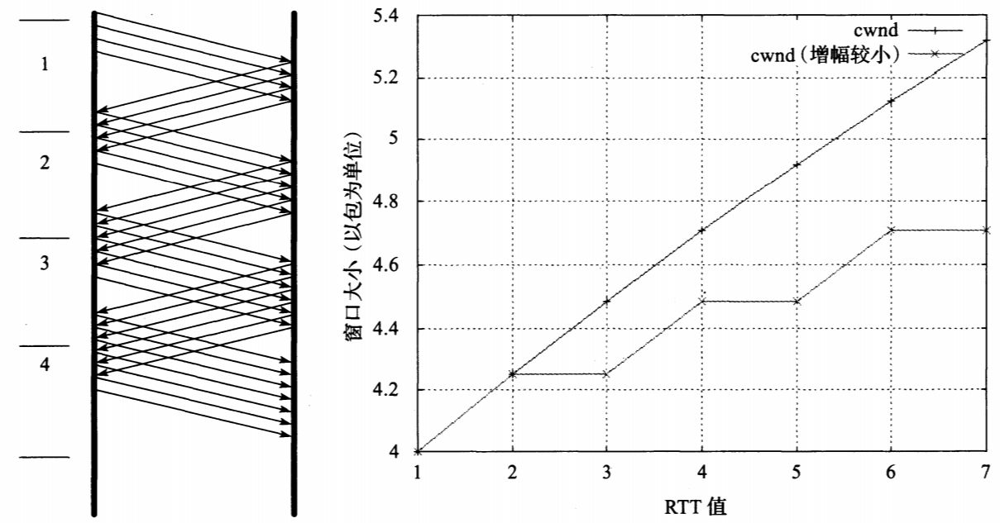

当TCP通信的接收方的接收速度无法匹配发送速度时, 发送方会降低发送速度。TCP的**流量控制**机制完成了对**发送速率**的调节, 它是基于ACK数据包中的通告窗口大小字段来实现的。这种方式提供了明确的接收方返回的状态信息, 避免接收方缓存溢出。

路由器因无法处理高速率到达的流量而被迫丢弃数据信息的现象称为**拥塞**。

## 减缓TCP发送

TCP发送端的发送速率等于接收速率和传输速率两者中较小值。

反映网络传输能力的变量称为**拥塞窗口**(congestion window),记作**cwnd**。因此, 发送端实际(可用)窗口**W**, 就是**接收端通知窗口awnd**和**拥塞窗口cwnd**的较小者:

- **W= min (cwnd, awnd)**

根据上述等式, TCP发送端发送的数据中, 还没有收到ACK回复的数据量不能多于W(以包或字节为单位)。这种**已经发出但还未经确认**的数据量大小有时称为**在外数据值**(mght size), 它总是小于等于W。

当TCP**不使用选择确**认机制时, w的限制作用体现为, 发送方发送的报文段序列号不能大于ACK号的最大值与w之和。而对**采用选择确认**的发送方则有所不同, w被用来限制在外数据值。

w的值不能过大或过小一我们希望其接近**带宽延迟积(Bandwidth-Delay Product, BDP)**, 也称作**最佳窗口大小**( optimal window size)， w反映网络中可存储的待发送数据量大小, 其计算值等于RTT与链路中最小通行速率(即发送端与接收端传输路径中的“瓶颈” )的乘积。

## 一些经典算法

TCP通过与接收端交换一个数据包就能获得awnd的值, 不需要任何明确的信号。显而易见, 获得cwnd最佳值的唯一方法是：以越来越快的速率不断发送数据, 直到出现数据包丢失(或网络拥塞)为止。这时考虑立即以可用的最大速率发送(受awnd的限制), 或是慢速启动发送。由于多个TCP连接共享一个网络传输路径, 以全速启动会影响其他连接的传输性能, 所以通常会有特定的算法来避免过快启动, 直至稳定传输后才会运行相应的其他算法。

这种由一个**ACK到**达(称作**ACK时钟**)触发一个新数据包传输的关系称为**自同步**(self-CIocking)。

**TCP的两个核心算法：慢启动和拥塞避免。**

## 慢启动

当一个新的TCP连接建立或检测到由重传超时(RTO)导致的丢包时, 需要执行慢启动。TCP发送端长时间处于空闲状态也可能调用慢启动算法。慢启动的目的是, 使TCP在用拥塞避免探寻更多可用带宽之前得到cwnd值, 以及帮助TCP建立ACK时钟。通常, TCP在建立新连接时执行慢启动, 直至有丢包时, 执行拥塞避免算法进入稳定状态。

在传输初始阶段, 由于未知网络传输能力, 需要缓慢探测可用传输资源, 防止短时间内大量数据注入导致拥塞。慢启动算法正是针对这一问题而设计。在数据传输之初或者重传计时器检测到丢包后,需要执行慢启动。TCP以发送一定数目的数据段开始慢启动(在SYN交换之后), 称为**初始窗口(Initial Window, IW)。**IW的值初始设为**一个SMSS** (发送方的最大段大小)。

TCP连接初始的cwnd= 1 SMSS, 意味着初始可用窗口W也为1 SMSS，注意到大部分情况下, SMSS为接收方的**MSS** (最大段大小)和**路径MTU** (最大传输单元)两者中较小值。假设没有出现丢包情况且每个数据包都有相应的ACK, 第一个数据段的ACK到达, 说明可发送一个新的数据段。每接收到一个好的ACK响应, 慢启动算法会以min (N，SMSS)来增加cwnd值。这里的N是指在未经确认的传输数据中能通过这一“**好的ACK**”确认的字节数。所谓的“**好的ACK”是指新接收的ACK号大于之前收到的ACK。**

在接收到一个数据段的ACK后, 通常cwnd值会增加到2, 接着会发送两个数据段。如果成功收到相应的新的ACK, cwnd会由2变4, 由4变8, 以此类推。一般情况下, 假设没有丢包且每个数据包都有相应ACK, 在k轮后W的值为w= 2^k, 即k= log2 W, 需要k个RTT时间操作窗口才能达到w大小。

cwnd会随着RTT呈**指数**增长。因此, 最终cwnd ( W也如此)会增至很大, 大量数据包的发送将导致网络瘫痪(TCP吞吐量与w/RTT成正比)。当发生上述情况时, cwnd将大幅度减小(减至原值一半)。这是TCP由**慢启动阶段至拥塞避免阶段的转折点**, 与cwnd和**慢启动阈值**相关**。**

经典慢启动算法操作。在**没有ACK延时**情况下, 每接收到一个好的ACK就意味着发送方可以发送两个新的数据包(左)。这会使得发送方窗口随时间呈指数增长(右,上方曲线)。当发生**ACK延时**, 如每隔一个数据包生成一个ACK, cwnd仍以指数增长, 但增幅较小(右,下方曲线)。

## 拥塞避免

一旦确立慢启动阈值, TCP会进人拥塞避免阶段, cwnd每次的增长值近似于成功传输的数据段大小。

通常认为拥塞避免阶段的窗口随时间**线性**增长(见图), 而慢启动阶段呈**指数**增长(见图)。这个函数也称为累加增长, 因为每成功接收到相应数据, cwnd就会增加一个特定值(这里大约是一个包大小)。

拥塞避免算法操作。若**没有ACK延时**发生, 每接收一个好的ACK, 就意味着发送方可继续发送1/w个新的数据包。发送窗口随时间近似呈线性增长(右,上方曲线)。当有ACK延时, 如每隔一个数据包生成一个ACK, cwnd仍近似呈线性增长, 只是增幅较小(右,下方曲线)。

## 慢启动和拥塞避免的选择

慢启动阈值。这个值和cwnd的关系是：决定采用慢启动还是拥塞避免的界线。当cwnd < ssthresh, 使用慢启动算法; 当cwnd > ssthresh, 需要执行拥塞避免; 而当两者相等时, 任何一种算法都可以使用。

慢启动阈值不是固定的, 而是随时间改变的。它的主要目的是, 在没有丢包发生的情况下, 记住上一次“最好的”操作窗口估计值。换言之, 它记录TCP最优窗口估计值的下界。

当有重传情况发生, 无论是超时重传还是快速重传, ssthresh会按下式改变:

- **ssthresh=max (在外数据值/2, 2\*SMSS)**

如果出现重传情况, TCP会认为操作窗口超出了网络传输能力范围。这时会将慢启动阈值(ssthresh)**减小至当前窗口大小的一半**(但不小于2*SMSS), 从而减小最优窗口估计值。这样通常会导致ssthresh减小, 但也有可能会使之增大。

## Tahoe、 Reno以及快速恢复算法

4.2版本的BSD (称为Tahoe)包含了一个TCP版本, 它在连接之初处于慢启动阶段, 若检测到丢包, 不论由于超时还是快速重传, 都会重新进入慢启动状态。有丢包情况发生时, Tahoe简单地将cwnd减为初始值(当时设为1 SMSS)以达到慢启动目的, 直至cwnd增长为ssthresh。问题是：对于有较大BDP的链路来说, 会使得带宽利用率低下。

解决这一问题, 针对不同的丢包情况, 重新考虑是否需要重回慢启动状态。若是由**重复ACK引起的丢包(引发快速重传),** **cwnd值将被设为上一个ssthresh**, 而非先前的1 SMSS，(在大多数TCP版本中, 超时仍是引发慢启动的主要原因。)这种方法使得TCP无须重新慢启动, 而只要把传输**速率减半**即可。

UNIX的4.3 BSD **Reno**版中的快速恢复机制就是基于上述结论。在恢复阶段, 每收到一个ACK, cwnd就能(临时)增长1 SMSS, 相应地就意味着能发送一个新的数据包。因此拥塞窗口在一段时间内会**急速增长**, 直到接收一个好的ACK，不重复的( “好的”) ACK表明TCP结束恢复阶段, 拥塞已减少到之前状态。

## 标准TCP

上述算法毋庸置疑都属于标准TCP，慢启动和拥塞避免算法通常结合使用。

在TCP连接建立之初**首先是慢启动**阶段( cwnd = IW), ssthresh通常取一较大值(至少为awnd)。当接收到一个好的ACK (表明新的数据传输成功), cwnd会相应更新：

- **cwnd+=SMSS (若cwnd<ssthresh)慢启动**
- **cwnd += SMSS\*SMSS/cwnd (若cwnd> ssthresh)拥塞避免**

当收到**三次重复ACK**(或其他表明需要快速重传的信号)时, 会执行以下行为:

\1. **ssthresh更新**为大于等式( ssthresh=max (在外数据值/2, 2*SMSS) )中的值。

\2. **启用快速重传**算法, 将cwnd设为(ssthresh + 3*SMSS)。

\3. 每接收一个**重复ACK**, cwnd值暂时增加1 SMSS。

\4. 当接收到一个**好的ACK**, 将cwnd重设为ssthresh。

以上第2步和第3步构成了**快速恢复**。步骤2设置cwnd大小, 首先cwnd通常会被减为之前值的一半。然后, 考虑到每接收一个重复ACK, 就意味着相应的数据包已成功传输(因此新的数据包就有发送机会), cwnd值会相应地暂时增大。这一步也可能出现cwnd加速递减的情况, 因为通常cwnd会乘以某个值(这里取0.5)来形成新的cwnd。

步骤3维持cwnd的增大过程, 使得发送方可以继续发送新的数据包(在不超过awnd的情况下)。

步骤4假设TCP已完成恢复阶段,所以cwnd的临时膨胀也消除了(有时称这一步为“收缩”)。

以下两种情况总会执行慢启动: **新连接的建立**以及出现**重传超时**。当发送方长时间处于**空闲**状态, 或者有理由怀疑cwnd不能精确反映网络当前拥塞状态时, 也可能引发慢启动。在这种情况下, cwnd的初始值将被设为重启窗口(RW)。推荐RW值为RW=min(IW，cwnd)。其他情况下,慢启动中cwnd初始设为IW。

## 对标准算法的改进

## NewReno

快速恢复带来的一个问题是：当一个传输窗口出现多个数据包丢失时, 一旦其中一个包重传成功, 发送方就会接收到一个**好的ACK**, 这样快速恢复阶段中cwnd窗口的暂时**膨胀就会停止**, 而事实上丢失的其他数据包可能并未完成重传。导致出现这种状况的ACK称为**局部ACK** (partial ACK)，Reno算法在接收到局部ACK后就停止拥塞窗口膨胀阶段, 并将其减小至特定值, 这种做法可能导致在重传计时器超时之前, 传输通道一直处于空闲状态。

为解决上述问题, 提出了一种改进算法, 称为**NewReno，**该算法对快速恢复做出了改进, 它记录了上一个数据传输窗口的最高序列号(即恢复点)。仅当接收到序列号不小于恢复点的ACK, 才停止快速恢复阶段。这样TCP发送方每接收一个ACK后就能继续发送一个新数据段, 从而减少重传超时的发生, 特别针对一个窗口出现多个包丢失的情况时。

## 采用选择确认机制的TCP拥塞控制

在快速重传/恢复情况下, 当出现丢包, TCP发送方只重传它认为已经丢失的包。如果窗口w允许, 还可以发送新的数据包。在快速恢复阶段, 由于窗口大小会随着每个ACK的到达而膨胀, 在完成重传后, 通常发送方能有更大的窗口发送更多新数据。采用SACK机制后, 发送方可以知晓多个数据段的丢失情况。

SACK TCP强调**拥塞管理**和**选择重传**机制的**分离**。传统(无SACK)TCP则将两者结合。一种实现分离的方法是：除了维护窗口, TCP还负责记录注入网络的数据量。 称其为**管道(pipe)变量**, 这是对在外数据的估计值。管道变量以字节(或包,依不同实现方式而定)为单位, 记录传输和重传情况(不考虑丢包, 将两者同等对待)。假设awnd值较大, 只要不等式cwnd - pipe >= SMSS成立, 在任何时候SACK TCP均可发送数据。

## 转发确认(FACK)和速率减半

对基于Reno (包括NewReno)的TCP版本来说, 当快速重传结束后cwnd值减小, 在TCP发送新数据之前至少可以接收一半已发送数据返回的ACK，这和检测到丢包后立即将拥塞窗口值减半相一致。这样TCP发送端在**前一半**的**RTT**时间内处于等待状态, 在**后一半RTT**才能发送新数据, 这是我们不愿看到的。

在丢包后, 为避免出现等待空闲而又不违背将拥塞窗口减半的做法, 提出了**转发确认（forward acknowledgment,FACK)**策略。FACK包含了两部分算法：称为“**过度衰减**” (overdamping)和“**缓慢衰减**” (rampdown)。从最初想法的提出到改进, 最终在Hoe的工作基础上[H96]形成了统一的算法, 称为**速率减半**(rate halving)。为控制算法尽可能有效地运行, 进一步添加了**界定参数**, 完整的算法被称为**带界定参数的速率减半**(Rate-Halving with Bounding Parameters, **RHBP**)算法。

RHBP的基本操作是, 在一个RTT时间内, 每接收**两个重复ACK**，TCP发送方可发送一个新数据包。这样在恢复阶段结束前, TCP已经发送了一部分新数据, 与之前的所有发送都挤在后半个RTT时间段内相比, 数据发送比较均衡。

为了记录较为精确的在外数据估计值, RHBP利用**SACK**信息决定FACK策略: 已知的最大序列号的数据到达接收方时, 在外数据值加1，FACK给出的在外数据估计值不包括重传，RHBP中区分了**调整间隔**( adiustment interval, **cwnd的修正阶段**)和**恢复间隔**(repair interval, **数据重传阶段)**。一旦出现丢包或其他拥塞信号就立即进入调整间隔。调整间隔结束后cwnd的最终值为: 至检测时间为止, 网络中已正确传输的窗口数据量的一半。

## 限制传输

[RFC3042]提出了限制传输( limited transmit), 它对TCP做出了微小改进, 目的在于使TCP能在可用窗口较小的情况下更好工作。

采用限制传输策略, TCP发送方每接收两个连续的重复ACK, 就能发送一个新数据包。这就使得网络中的数据包维持一定数量——足以触发快速重传。

## 拥塞窗口校验

提出了一种**拥塞窗口校验( Congestion Window Vandation, CWV)**机制。在发送长时间暂停的情况下, 由ssthresh维护cwnd保存的“记忆”, 之后cwnd值会衰减。为理解这种机制,需要区分**空闲**( idle)发送端和**应用受限**(application-limited)发送端。

对空闲发送端而言, 没有发送新数据的需求, 之前发送的数据也已经成功接收ACK。

应用受限发送端则需要传输数据, 但由于某种原因无法发送。

CWV算法原理如下: 当需要发送新数据时, 首先看距离上次发送操作是否超过一个 RTO，如果超过, 则：

●更新ssthresh值一一设为max (SSthresh, (3/4) *cwnd)。

●每经一个空闲RTT时间, cwnd值就减半, 但不小于1 SMSS。

对于**应用受限**阶段(非空闲阶段), 执行相似的操作:

●已使用的窗口大小记为W_used。

●更新ssthresh值一一设为max (ssthresh, (3/4) *cwnd)。

● cwnd设为cwnd和W_used的平均值。

上述操作均减小了cwnd, 但ssthresh维护了cwnd的先前值。第一种情况中, 如果传输通道长时间空闲, cwnd将会显著减小。

## 伪RTO处理-Eifel晌应算法

重传超时, TCP会调整ssthresh并将cwnd置为IW, 从而进入慢启动状态。

Eifel响应算法用于处理重传计时器以及重传计时器超时后的拥塞控制操作。