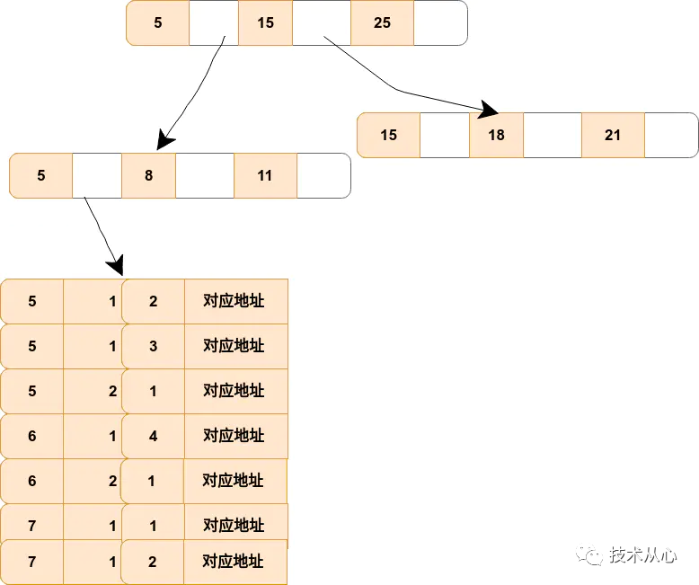

## **最左前缀匹配原则**

在mysql建立联合索引时会遵循最左前缀匹配的原则，即最左优先，在检索数据时从联合索引的最左边开始匹配，示例：
对列col1、列col2和列col3建一个联合索引

```cmake
KEY test_col1_col2_col3 on test(col1,col2,col3);
```

联合索引 test_col1_col2_col3 实际建立了(col1)、(col1,col2)、(col,col2,col3)三个索引。

```routeros
SELECT * FROM test WHERE col1=“1” AND clo2=“2” AND clo4=“4”
```

上面这个查询语句执行时会依照最左前缀匹配原则，检索时会使用索引(col1,col2)进行数据匹配。

## **注意**

索引的字段可以是任意顺序的，如：

```routeros
SELECT * FROM test WHERE col1=“1” AND clo2=“2”
SELECT * FROM test WHERE col2=“2” AND clo1=“1”
```

这两个查询语句都会用到索引(col1,col2)，mysql创建联合索引的规则是首先会对联合合索引的最左边的，也就是第一个字段col1的数据进行排序，在第一个字段的排序基础上，然后再对后面第二个字段col2进行排序。其实就相当于实现了类似 order by col1 col2这样一种排序规则。

有人会疑惑第二个查询语句不符合最左前缀匹配：首先可以肯定是两个查询语句都包含索引(col1,col2)中的col1、col2两个字段，只是顺序不一样，查询条件一样，最后所查询的结果肯定是一样的。既然结果是一样的，到底以何种顺序的查询方式最好呢？此时我们可以借助mysql查询优化器explain，explain会纠正sql语句该以什么样的顺序执行效率最高，最后才生成真正的执行计划。


## **为什么要使用联合索引**

- **减少开销**。建一个联合索引(col1,col2,col3)，实际相当于建了(col1),(col1,col2),(col1,col2,col3)三个索引。每多一个索引，都会增加写操作的开销和磁盘空间的开销。对于大量数据的表，使用联合索引会大大的减少开销！
- **覆盖索引**。对联合索引(col1,col2,col3)，如果有如下的sql: select col1,col2,col3 from test where col1=1 and col2=2。那么MySQL可以直接通过遍历索引取得数据，而无需回表，这减少了很多的随机io操作。减少io操作，特别的随机io其实是dba主要的优化策略。所以，在真正的实际应用中，覆盖索引是主要的提升性能的优化手段之一。
- **效率高**。索引列越多，通过索引筛选出的数据越少。有1000W条数据的表，有如下sql:select *from table where col1=1 and col2=2 and col3=3,假设假设每个条件可以筛选出10%的数据，如果只有单值索引，那么通过该索引能筛选出1000W*10%=100w条数据，然后再回表从100w条数据中找到符合col2=2 and col3= 3的数据，然后再排序，再分页；如果是联合索引，通过索引筛选出1000w*10%* 10% *10%=1w，效率提升可想而知！

## **引申**

对于联合索引(col1,col2,col3)，查询语句SELECT * FROM test WHERE col2=2;是否能够触发索引？
大多数人都会说NO，实际上却是YES。
**原因**：

```n1ql
EXPLAIN SELECT * FROM test WHERE col2=2;
EXPLAIN SELECT * FROM test WHERE col1=1;
```

观察上述两个explain结果中的type字段。查询中分别是：

1. type: index
2. type: ref

**index**：这种类型表示mysql会对整个该索引进行扫描。要想用到这种类型的索引，对这个索引并无特别要求，只要是索引，或者某个**联合索引的一部分**，mysql都可能会采用index类型的方式扫描。但是呢，缺点是效率不高，mysql会从索引中的第一个数据一个个的查找到最后一个数据，直到找到符合判断条件的某个索引。所以，上述语句会触发索引。
**ref**：这种类型表示mysql会根据特定的算法快速查找到某个符合条件的索引，而不是会对索引中每一个数据都进行一一的扫描判断，也就是所谓你平常理解的使用索引查询会更快的取出数据。而要想实现这种查找，索引却是有要求的，要实现这种能快速查找的算法，索引就要满足特定的数据结构。简单说，**也就是索引字段的数据必须是有序的，才能实现这种类型的查找，才能利用到索引。**


## **最左匹配原则的原理** 

最左匹配原则都是针对联合索引来说的，所以我们可以从联合索引的原理来了解最左匹配原则。

我们都知道索引的底层是一颗 B+ 树，那么联合索引当然还是一颗 B+ 树，只不过联合索引的键值数量不是一个，而是多个。构建一颗 B+ 树只能根据一个值来构建，因此数据库依据联合索引最左的字段来构建 B+ 树。例子：假如创建一个（a,b,c)的联合索引，那么它的索引树是这样的：



该图就是一个形如(a,b,c)联合索引的 b+ 树，其中的非叶子节点存储的是第一个关键字的索引 a，而叶子节点存储的是三个关键字的数据。这里可以看出 a 是有序的，而 b，c 都是无序的。但是当在 a 相同的时候，b 是有序的，b 相同的时候，c 又是有序的。通过对联合索引的结构的了解，那么就可以很好的了解为什么最左匹配原则中如果遇到范围查询就会停止了。以 select * from t where a=5 and b>0 and c =1; #这样a,b可以用到（a,b,c），c不可以 为例子，当查询到 b 的值以后（这是一个范围值），c 是无序的。所以就不能根据联合索引来确定到底该取哪一行。

## **总结** 

在 InnoDB 中联合索引只有先确定了前一个（左侧的值）后，才能确定下一个值。如果有范围查询的话，那么联合索引中使用范围查询的字段后的索引在该条 SQL 中都不会起作用。值得注意的是，in 和 = 都可以乱序，比如有索引（a,b,c），语句 select * from t where c =1 and a=1 and b=1，这样的语句也可以用到最左匹配，因为 [MySQL](https://cloud.tencent.com/product/cdb?from=10680) 中有一个优化器，他会分析 SQL 语句，将其优化成索引可以匹配的形式，即 select * from t where a =1 and a=1 and c=1


https://segmentfault.com/a/1190000015416513