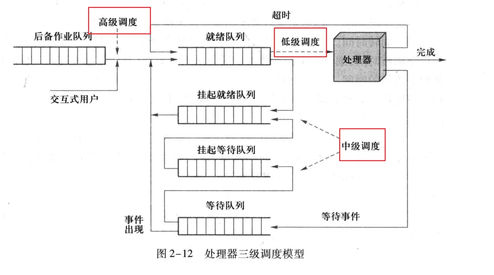

处理器调度可按照层级分为三级：

- 高级调度
- 中级调度
- 低级调度

> 用户作业从进入系统成为后备作业开始，知道运行结束退出系统为止，最多经历三层级别的调度。
> 低级调度是各类操作系统的必备功能。
> 在纯粹分时操作系统或实时操作系统中通常不需要高级调度。
> 一般操作系统都配置了高级调度和低级调度，而功能完善的操作系统为了提高内存利用率和作业吞吐率引进了中级调度。
> 所以从处理器调度的层次来说，可分为三级调度模型和两级调度模型。

## **1.1 高级调度**

高级调度：即作业调度，按照一定策略将选择磁盘上的程序装入内存，并建立进程。（存在与多道批处理系统中）

> 这里解释一下作业和进程的区别与联系
> 作业可分为：编译、链接、装入、和运行这4个作业步。
> 当一个作业被作业调度（高级调度）选中进入内存并投**入运行时**，操作系统为此用户作业生成用户进程完成其计算任务。
> **进程是已提交完毕并选中运行的作业（程序）的执行实体**，也是为完成作业任务向系统申请和分配资源的基本单位，它处于运行，就绪，等待等多个状态变化之中。
> 综上所述：

- 作业是任务实体，进程是完成任务的执行实体
- 没有作业任务，进程无事可做；没有进程，作业任务无法完成
- 作业的概念更多的用于批处理操作系统；进程多用于各种多道程序设计系统

## **1.2中级调度**

中级调度：即交换调度，按照一定策略在内外存之间进行数据交换。

> 当内存资源紧缺时，会把暂时不能运行的进程换出内存，此时这个进程处于“挂起”状态，不参与低级调度；当进程具备运行条件且内存资源富裕时，再将进程重新回调内存工作。
> 起到短期均衡系统负载的作用，充分提高内存利用率和系统吞吐率。

## **1.3低级调度**

低级调度：即CPU调度（进程调度），按照一定策略选择就绪进程，占用cpu执行。

> 根据某种原则决定就绪队列中的哪个进程/线程获得处理器，并将处理器出让给他使用。
> 低级调度是各类操作系统的必备功能，在纯粹分时操作系统或实时操作系统中通常不需要高级调度。

首先了解一下低级调度（进程调度）的基本类型：

- 剥夺式 （preemptive）：剥夺式又称为抢先式。当进程/线程正在处理器上运行时，系统可根据规定的与原则剥夺分配给此进程/线程的处理器，并将其移入就绪队列，选择其他进程/线程运行。
  有两种常用处理器剥夺原则：
  1.高优先级进程/线程可以剥夺低优先级进程/线程；
  2.当运行进程/线程时间片用完后被剥夺，在动态改变进程/线程优先级的系统中，经常会出现这种情况。
  剥夺式策略可以避免进程/线程长时间独自占用处理器，对于实时系统和分时系统有利。
- 非剥夺式 (nonpreemptive)：非剥夺式又称为非抢先式。一旦某个进程/线程开始运行后便不再让出处理器，除非此进程/线程运行结束或主动放弃处理器，或因发生某个事件而不能继续运行。

