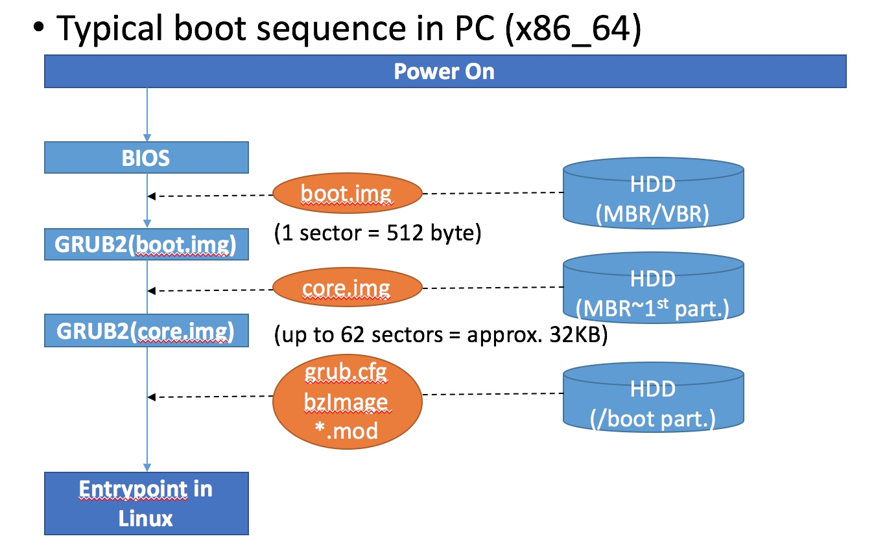

## bios到kernel的启动过程，实模式和保护模式所做的操作，转换后mmu的作用。

## 什么是 BIOS？

简单来说 BIOS 也是一段程序代码，但是它比较特殊，它是 CPU 启动后执行的第一段代码，存储在 PC 设备中的只读存储器（ROM）中，主要完成检测内存、显卡等一系列硬件设备和建立中断向量表（IVT，Interrupt Vector Table）的工作。

ROM 其实也一块内存，它会被映射到 CPU 实模式下所能访问的 1MB 物理内存空间的顶部，即地址 `0xF000:0000 ~ 0xF000:FFFF`。

在这里补充一下， X86 处理器有两种运行模式一种是实模式，另外一种是保护模式，它们两者之间最主要的区别就是：实模式下 CPU 访问内存的地址采用的是**分段**方式（也就是**段基址：段内便宜**），生成的是可以直接访问物理内存的**物理地址**，而保护模式下 CPU 访问内存的地址采用的是**分页**方式，生成的是**虚拟地址**，不能直接访问物理内存，需要通过 **MMU** 硬件将虚拟地址转换为物理地址后才能访问物理内存。

## BIOS 启动过程

1. 当 X86 架构的 PC 在开机上电的一瞬间，CPU 中的 **CS** 和 **IP** 寄存器就被设置成了 `0xF000:FFF0`（这个地址就是 BIOS 代码所在内存区域），这个地址指向了 CPU 执行第一条指令的位置。而在这个地址里只存放了一条非常简单的跳转指令 `jmp far f000:e05b`，然后程序就跳转到了 BIOS 代码中的另外一个地址 `f000:e05b` 处开始接着往下执行。

2. 接下来，BIOS 就马不停蹄地检测内存、显卡等外设信息，当硬件检测通过之后，就在内存的物理内存的起始位置 `0x000 ~ 0x3FF` （刚好 1KB 的内存空间)建立中断向量表（IVT），如上图物理内存最底部的所示。

   x86 中断向量表中有 256 个中断向量，每个中断向量用 4 个字节来表示（CS 用两个字节表示，IP 也用两个字节表示），通过中断向量中保存的 `CS:IP` 地址就可以跳转到对应的中断处理程序去处理中断请求信号。

3. 最后，BIOS 将**启动磁盘**中的第 1 个扇区（MBR 扇区，Master Boot Record）的 512 个字节的数据加载到物理内存地址为 `0x7C00 ~ 0x7E00` 的区域，然后程序就跳转到 `0x7C00` 处开始执行，至此，BIOS 就完成了所有的工作，将控制权转交到了 MBR 中的代码。

## MBR 扇区

MBR（Master Boot Record）扇区是启动磁盘中的第 1 个扇区，它主要由三部分组成：第一部分是一段引导程序，主要用来加载启动内核所需 Bootloader 程序；第二部分是当前启动磁盘的分区表；第三部分是标识 MBR 扇区的魔数 **0x55** 和 **0xAA**。

MBR 分区组成结构如下图所示：

## Bootloader 加载程序

Bootloader 是一段用来将 Linux Kernel 镜像文件加载到物理内存中指定地址的程序，这里所指的 Bootloader 是广义上概念，其实它还可以细分成两个独立的 bootloader：

- **第一个 bootloader**：由 MBR 扇区中的前 446 个字节构成，作用是找到第二个 bootloader 并将其加载到物理内存中，并跳转到第二个 bootloader 中执行。
- **第二个 bootloader**：这个 bootloader 位于启动盘中 MBR 扇区之后，根据 bootloader 代码的大小可能会占用一个或多个磁盘分区，它的主要作用就是找到磁盘中存放的 Linux Kernel 镜像文件以及 initrd 文件（如果在内核命令行参数中指定了的话），并将其加载到物理内存当中。

**注：initrd 是 initialized ram disk 的意思。主要用于加载硬件驱动模块，辅助内核的启动，挂载真正的根文件系统。**

上述这两个 bootloader 程序合在一起就构成了我们在 Linux 系统中经常用到的两个 Bootloader 程序，LILO（Linux Loader）或者是 GRUB（Grand Unified Boot Loader）。

GRUB 是我们现在 Linux 发行版系统中最常用到的 Bootloader，它的**优势在于它可以识别 Linux 文件系统**，例如 ext3，ext4 格式的文件系统。不像 LILO 只能从原始的磁盘扇区中加载 Linux Kernel 镜像，GRUB 可以从 ext3 或者 ext4 格式文件系统的磁盘分区中加载 Linux Kernel 镜像。

总结一下 Bootloader 主要完成了下面几项工作：

1. 从 MBR 扇区中的第一个 bootloader 程序跳转实际执行内核加载操作的第二个 bootloder 程序。
2. 第二个 bootloder 程序查找 Linux Kernel 镜像在启动盘中的位置（要么存放磁盘中的固定位置，要么通过文件系统去解析）。
3. 将找到的 Linux Kernel 镜像和 initrd 文件加载到物理内存中的指定地址处，并建立运行内核的所需的基本环境。
4. 最后，Bootloader 就将控制权转交到 Linux 内核，然后由内核开始执行。

x86 系统中 Bootloader 加载内核启动的过程，如下图所示：

## Linux Kernel 加载过程

Bootloader 将内核镜像加载到物理内存之后，内存的布局如下所示：

整个Linux Kernel 的加载过程就是对 Linux Kernel 镜像分阶段加载，然后在实模式中进行一些基本硬件的设置，建立页表等操作之后，跳转到保护模式下的内核入口开始执行。

## 实模式下内核加载过程

Bootloader 在找到内核镜像之后，第一步做的工作就是将内核镜像文件中的起始第一部分 **boot/setup.bin** 加载到 **0x7c00** 地址之上的物理内存中，然后跳转到 setup.bin 文件中的入口地址开始执行，注意这部分的代码是在**实模式**下运行的。

如在 **Linux Kernel 镜像生成过程** 小节中可启动的内核镜像图所示，boot/setup.bin 文件是由 **boot sector**（注意这个 boot sector 和 MBR 扇区是不一样的，是内核中遗留下来的一块地方，现在基本不怎么使用这块地方了，可能在其他体系架构的内核镜像中会使用这一部分来存储一些参数） 和 **setup 代码** 组成，其中 boot sector 占用了 512 字节的空间。

实模式设置（setup）阶段主要完成一些**体系结构相关的硬件初始化工作**，涉及的文件有 *arch/x86/boot/header.S*、链接脚本*setup.ld*、*arch/x86/boot/main.c*。header.S 第一部分定义了 .bstext、.bsdata、.header 这 3 个节，共同构成了vmlinuz 的第一个512字节(即引导扇区的内容)。常量 BOOTSEG 和SYSSEG 定义了引导扇区和内核的载入的地址。

**arch/x86/boot/main.c:main()** 函数主要完成的工作：

1. 调用 `copy_boot_params` 函数把位于第一个扇区(boot/setup.bin 中的 boot sector)的参数复制到 **boot_params** 变量中，boot_params 变量位于 **boot/setup.bin** 的数据段。
2. 初始化早期启动状态下的控制台（console）。
3. 初始化堆空间。
4. 检测 CPU 相关信息。
5. 通过向 BIOS 查询的方式，收集硬件相关信息，并将结果存放在第 0 号物理页中。
6. 调用了 `arch/x86/boot/pm.c:go_to_protected_mode(void) ---> arch/x86/boot/pmjump.S:protected_mode_jump()` 函数，从 bzImage 中的 `boot/setup.bin` **实模式部分**的代码跳转到了 `boot/vmlinux.bin` **保护模式**的代码。

## 保护模式下内核加载过程

执行完 **boot/setup.bin** 部分的代码之后，Bootloader 就接着把内核镜像 bzImage 中的第二部分 **boot/vmlinux.bin** 加载到物理内存中起始地址为 **0x100000** 的位置，boot/vmlinux.bin 代码在**保护模式**下的入口是 `arch/x86/boot/compressed/head_32.S::startup_32` 汇编代码，这段汇编代码中主要完成两个工作：

- 将 boot/vmlinux.bin 文件中解压内核的代码拷贝到物理内存中 boot/vmlinux.bin 的后面。
- 初始化 stack 和 heap 空间。
- 解压缩内核，解压缩后的内核就是我们从源码编译得到的 vmlinux ELF 可执行文件。
- 如果有选项指定，可能还需要对解压后的内核地址进行一个重定位（Relocate）。
- 最后，跳转到解压缩后的内核文件 vmlinux 中的入口函数开始启动内核。

解压缩后的内核文件 vmlinux 的入口函数是 `arch/x86/kernel/head_32.S::startup_32` 中的startup_32（32位内核的入口函数），在这个函数中会拷贝 **boot_params** 结构体变量以及**boot_command_line**，初始化页表，开启分页机制。startup_32() 汇编代码会接着调用 `init/main.c:start_kernel()` 函数，这是Linux 内核的启动函数。`init/main.c` 文件是整个 Linux 内核的中央联结点。每种体系结构都会执行一些底层设置函数，然后执行名为`start_kernel` 的函数（在 init/main.c 中可以找到这个函数）。可以认为 main.c 是内核的“粘合剂（glue）”，之前执行的代码都是**各种体系结构相关**的代码，一旦到达**start_kernel()**，就与体系结构无关了。

至此，Linux Kernel 的加载过程就分析完毕了，整个过程可以用下面这张图来总结一下：

