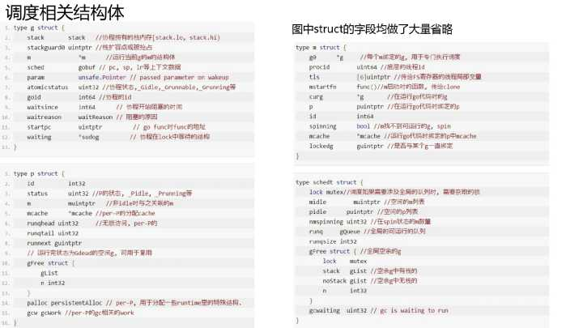
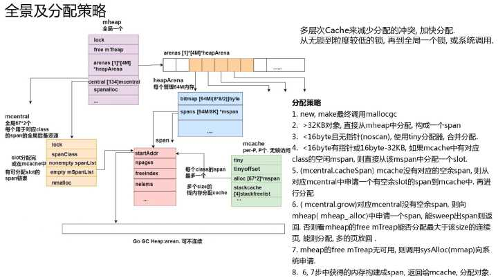

Go runtime的调度器：
在了解Go的运行时的scheduler之前，需要先了解为什么需要它，因为我们可能会想，OS内核不是已经有一个线程scheduler了嘛？
熟悉POSIX API的人都知道，POSIX的方案在很大程度上是对Unix process进场模型的一个逻辑描述和扩展，两者有很多相似的地方。 Thread有自己的信号掩码，CPU affinity等。但是很多特征对于Go程序来说都是累赘。 尤其是context上下文切换的耗时。另一个原因是Go的垃圾回收需要所有的goroutine停止，使得内存在一个一致的状态。垃圾回收的时间点是不确定的，如果依靠OS自身的scheduler来调度，那么会有大量的线程需要停止工作。 

单独的开发一个GO得调度器，可以是其知道在什么时候内存状态是一致的，也就是说，当开始垃圾回收时，运行时只需要为当时正在CPU核上运行的那个线程等待即可，而不是等待所有的线程。


[用户空间线程](https://www.zhihu.com/search?q=用户空间线程&search_source=Entity&hybrid_search_source=Entity&hybrid_search_extra={"sourceType"%3A"answer"%2C"sourceId"%3A27964865})和内核空间线程之间的映射关系有：N:1,1:1和M:N
N:1是说，多个（N）[用户线程](https://www.zhihu.com/search?q=用户线程&search_source=Entity&hybrid_search_source=Entity&hybrid_search_extra={"sourceType"%3A"answer"%2C"sourceId"%3A27964865})始终在一个内核线程上跑，context上下文切换确实很快，但是无法真正的利用多核。
1：1是说，一个用户线程就只在一个内核线程上跑，这时可以利用多核，但是上下文switch很慢。
M:N是说， 多个[goroutine](https://www.zhihu.com/search?q=goroutine&search_source=Entity&hybrid_search_source=Entity&hybrid_search_extra={"sourceType"%3A"answer"%2C"sourceId"%3A27964865})在多个内核线程上跑，这个看似可以集齐上面两者的优势，但是无疑增加了调度的难度。


Go的调度器内部有三个重要的结构：M，P，S
M:代表真正的内核[OS线程](https://www.zhihu.com/search?q=OS线程&search_source=Entity&hybrid_search_source=Entity&hybrid_search_extra={"sourceType"%3A"answer"%2C"sourceId"%3A27964865})，和POSIX里的thread差不多，真正干活的人
G:代表一个goroutine，它有自己的栈，instruction pointer和其他信息（正在等待的channel等等），用于调度。
P:代表调度的上下文，可以把它看做一个局部的调度器，使go代码在一个线程上跑，它是实现从N:1到N:M映射的关键。


为何要维护多个上下文P？因为当一个OS线程被阻塞时，P可以转而投奔另一个OS线程！
图中看到，当一个OS线程M0陷入阻塞时，P转而在OS线程M1上运行。调度器保证有足够的线程来运行所以的context P。

作者：腾讯技术工程
链接：https://www.zhihu.com/question/20862617/answer/921061289
来源：知乎
著作权归作者所有。商业转载请联系作者获得授权，非商业转载请注明出处。


我们去看调度的一个进化, 从进程到线程再到协程, 其实是一个不断共享, 不断减少切换成本的过程. go 实现的协程为[有栈协程](https://www.zhihu.com/search?q=有栈协程&search_source=Entity&hybrid_search_source=Entity&hybrid_search_extra={"sourceType"%3A"answer"%2C"sourceId"%3A921061289}), go 协程的用法和线程的用法基本类似. 很多人会疑问, 协程到底是个什么东西? [用户态](https://www.zhihu.com/search?q=用户态&search_source=Entity&hybrid_search_source=Entity&hybrid_search_extra={"sourceType"%3A"answer"%2C"sourceId"%3A921061289})的调度感觉很陌生, 很抽象, 到底是个什么东西?

我觉得要理解调度, 要理解两个概念: 运行和阻塞. 特别是在协程中, 这两个概念不容易被正确理解. 我们理解概念时往往会代入自身感受, 觉得线程或协程运行就是像我们吭哧吭哧的处理事情, 线程或协程阻塞就是做事情时我们需要等待其他人. 然后就在这等着了. 要是其他人搞好了, 那我们就继续做当前的事.

其实主体对象搞错了.正确的理解应该是我们处理事情时就像 CPU, 而不是像线程或者协程. 假如我当前在写某个服务, 发现依赖别人的函数还没有 ready, 那就把写服务这件事放一边. 点开企业微信, 我去和产品沟通一些问题了. 我和产品沟通了一会后, 检查一下, 发现别人已经把依赖的函数提交了, 然后我就最小化企业微信, 切到 IDE, 继续写服务 A 了.

对操作系统有过一些了解, 知道 linux 下的线程其实是 task_struct 结构, 线程其实并不是真正运行的实体, 线程只是代表一个执行流和其状态.真正运行驱动流程往前的其实是 CPU. CPU 在时钟的驱动下, 根据 PC 寄存器从程序中取指令和操作数, 从 RAM 中取数据, 进行计算, 处理, 跳转, 驱动执行流往前. CPU 并不关注处理的是线程还是协程, 只需要设置 PC 寄存器, 设置栈指针等(这些称为上下文), 那么 CPU 就可以欢快的运行这个线程或者这个协程了.

线程的运行, 其实是被运行.其阻塞, 其实是切换出调度队列, 不再去调度执行这个执行流. 其他执行流满足其条件, 便会把被移出调度队列的执行流重新放回调度队列.协程同理, 协程其实也是一个数据结构, 记录了要运行什么函数, 运行到哪里了.
go 在用户态实现调度, 所以 go 要有代表协程这种执行流的结构体, 也要有保存和恢复上下文的函数, 运行队列. 理解了阻塞的真正含义, 也就知道能够比较容易理解, 为什么 go 的锁, channel 这些不阻塞线程.

对于实现的同步执行流效果, 又不阻塞线程的网络, 接下来也会介绍.

### **协程结构体和切换函数**


我们 go 一个 func 时一般这样写

```text
go func1(arg1 type1,arg2 type2){....}(a1,a2)
```

一个协程代表了一个执行流, 执行流有需要执行的函数(对应上面的 func1), 有函数的入参(a1, a2), 有当前执行流的状态和进度(对应 CPU 的 PC 寄存器和 SP 寄存器), 当然也需要有保存状态的地方, 用于执行流恢复.

真正代表协程的是 runtime.g 结构体. 每个 go func 都会编译成 runtime.newproc 函数, 最终有一个 runtime.g 对象放入调度队列. 上面的 func1 函数的指针设置在 runtime.g 的 startfunc 字段, 参数会在 newproc 函数里拷贝到 stack 中, sched 用于保存协程切换时的 pc 位置和栈位置.

协程切换出去和恢复回来需要保存上下文, 恢复上下文, 这些由以下两个汇编函数实现. 以上就能实现协程这种执行流, 并能进行切换和恢复.(下图中的 struct 和函数都做了精简)

### **GM 模型及 GPM 模型**


有了协程的这种执行流形式, 那待运行的协程放在哪呢?
在 Go1.0 的时候:

1. 调度队列 schedt 是全局的, 对该队列的操作均需要竞争同一把锁, 导致伸缩性不好.
2. 新生成的协程也会放入全局的队列, 大概率是被其他 m(可以理解为底层线程的一个表示)运行了, 内存亲和性不好. 当前协程 A 新生成了协程 B, 然后协程 A 比较大概率会结束或者阻塞, 这样 m 直接去执行协程 B, 内存的亲和性也会好很多.
3. 因为 [mcache](https://www.zhihu.com/search?q=mcache&search_source=Entity&hybrid_search_source=Entity&hybrid_search_extra={"sourceType"%3A"answer"%2C"sourceId"%3A921061289}) 与 m 绑定, 在一些应用中(比如文件操作或其他可能会阻塞线程的系统调用比较多), m 的个数可能会远超过活跃的 m 个数, 导致比较大的内存浪费.

那是不是可以给 m 分配一个队列, 把阻塞的 m 的 mcache 给执行 go 代码的 m 使用? Go 1.1 及以后就是这样做的.


再 1.1 中调度模型更改为 GPM 模型, 引入逻辑 Process 的概念, 表示执行 Go 代码所需要的资源, 同时也是执行 Go 代码的最大的并行度.

这个概念可能很多人不知道怎么理解. P 涉及到几点, 队列和 mcache, 还有 P 的个数的选取.

首先为什么把全局队列打散, 以及 mcache 为什么跟随 P, 这个在 GM 模型那一页就讲的比较清楚了.然后为什么 P 的个数默认是 CPU 核数: Go 尽量提升性能, 那么在一个 n 核机器上, 如何能够最大利用 CPU 性能呢? 当然是同时有 n 个线程在并行运行中, 把 CPU 喂饱, 即所有核上一直都有代码在运行.

在 go 里面, 一个协程运行到阻塞系统调用, 那么这个协程和运行它的线程 m, 自然是不再需要 CPU 的, 也不需要分配 go 层面的内存. 只有一直在并行运行的 go 代码才需要这些资源, 即同时有 n 个 go 协程在并行执行, 那么就能最大的利用 CPU, 这个时候需要的 P 的个数就是 CPU 核数. (注意并行和并发的区别)

## **协程状态及流转**


协程的状态其实和线程状态类似,状态转换和发生状态转换的时机如图所示. 还是需要注意: 协程只是一个执行流, 并不是运行实体.

## **调度**


并没有一个一直在运行调度的调度器实体. 当一个协程切换出去或新生成的 m, go 的运行时从 stw 中恢复等情况时, 那么接下来就需要发生调度. go 的调度是通过线程(m)执行 runtime.schedule 函数来完成的.

## **sysmon 协程**


在 linux 内核中有一些执行定时任务的线程, 比如定时写回脏页的 pdflush, 定期回收内存的 kswapd0, 以及每个 cpu 上都有一个负责负载均衡的 migration 线程等.在 go 运行时中也有类似的协程, sysmon.功能比较多: 定时从 netpoll 中获取 ready 的协程, 进行抢占, 定时 GC,打印调度信息,归还内存等定时任务.

## **协作式抢占**


go 目前(1.12)还没有实现非协作的抢占. 基本流程是 sysmon 协程标记某个协程运行过久, 需要切换出去, 该协程在运行函数时会检查栈标记, 然后进行切换.

## **同步执行流不阻塞线程的网络的实现**


go 写后台最舒服的就是能够以同步写代码的方式操作网络, 但是网络操作不阻塞线程.主要是结合了非阻塞的 fd, epoll 以及协程的切换和恢复.linux 提供了网络 fd 的非阻塞模式, 对于没有 ready 的非阻塞 fd 执行网络操作时, linux 内核不阻塞线程, 会直接返回 EAGAIN, 这个时候将协程状态设置为 wait, 然后 m 去调度其他协程.

go 在初始化一个网络 fd 的时候, 就会把这个 fd 使用 epollctl 加入到全局的 epoll 节点中. 同时放入 epoll 中的还有 polldesc 的指针.

```text
func netpollopen(fd uintptr, pd *pollDesc) int32 {
    var ev epollevent
    ev.events = _EPOLLIN | _EPOLLOUT | _EPOLLRDHUP | _EPOLLET
    *(**pollDesc)(unsafe.Pointer(&ev.data)) = pd
    return -epollctl(epfd, _EPOLL_CTL_ADD, int32(fd), &ev)
}
```

在 sysmon 中, schedule 函数中, start the world 中等情况下, 会执行 netpoll 调用 epollwait 系统调用, 把 ready 的网络事件从 epoll 中取出来, 每个网络事件可以通过前面传入的 polldesc 获取到阻塞在其上的协程, 以此恢复协程为 runnable.

## **调度相关结构体**



## **调度综述**


## **内存分配**

## **内存分配简介**


Go 的分配采用了类似 tcmalloc 的结构.特点: 使用一小块一小块的连续内存页, 进行分配某个范围大小的内存需求. 比如某个连续 8KB 专门用于分配 17-24 字节,以此减少内存碎片. 线程拥有一定的 cache, 可用于无锁分配.

同时 Go 对于 GC 后回收的[内存页](https://www.zhihu.com/search?q=内存页&search_source=Entity&hybrid_search_source=Entity&hybrid_search_extra={"sourceType"%3A"answer"%2C"sourceId"%3A921061289}), 并不是马上归还给操作系统, 而是会延迟归还, 用于满足未来的内存需求.

## **内存空间结构**


在 1.10 以前 go 的堆地址空间是线性连续扩展的, 比如在 1.10(linux amd64)中, 最大可扩展到 512GB. 因为 go 在 gc 的时候会根据拿到的指针地址来判断是否位于 go 的 heap 的, 以及找到其对应的 span, 其判断机制需要 gc heap 是连续的. 但是连续扩展有个问题, cgo 中的代码(尤其是 32 位系统上)可能会占用未来会用于 go heap 的内存. 这样在扩展 go heap 时, mmap 出现不连续的地址, 导致运行时 throw.

在 1.11 中, 改用了[稀疏索引](https://www.zhihu.com/search?q=稀疏索引&search_source=Entity&hybrid_search_source=Entity&hybrid_search_extra={"sourceType"%3A"answer"%2C"sourceId"%3A921061289})的方式来管理整体的内存. 可以超过 512G 内存, 也可以允许内存空间扩展时不连续.在全局的 mheap struct 中有个 arenas 二阶数组, 在 linux amd64 上,一阶只有一个 slot, 二阶有 4M 个 slot, 每个 slot 指向一个 heapArena 结构, 每个 heapArena 结构可以管理 64M 内存, 所以在新的版本中, go 可以管理 4M*64M=256TB 内存, 即目前 64 位机器中 48bit 的寻址总线全部 256TB 内存.

## **span 机制**


前面提到了 go 的内存分配类似于 [tcmalloc](https://www.zhihu.com/search?q=tcmalloc&search_source=Entity&hybrid_search_source=Entity&hybrid_search_extra={"sourceType"%3A"answer"%2C"sourceId"%3A921061289}), 采用了 span 机制来减少内存碎片. 每个 span 管理 8KB 整数倍的内存, 用于分配一定范围的内存需求.

## **内存分配全景**



多层次的分配 Cache, 每个 P 上有一个 mcache, mcache 会为每个 size 最多缓存一个 span, 用于无锁分配. 全局每个 size 的 span 都有一个 mcentral, 锁的粒度相对于全局的 heap 小很多, 每个 mcentral 可以看成是每个 size 的 span 的一个全局后备 cache.

在 gc 完成后, 会把 P 中的 span 都 flush 到 mcentral 中, 用于清扫后再分配. P 有需要 span 时, 从对应 size 的 mcentral 获取. 获取不到再上升到全局的 heap.

## **几种特殊的分配器**


对于很小的对象分配, go 做了个优化, 把小对象合并, 以移动指针的方式分配.对于栈内存有 stackcache 分配, 也有多个层次的分配, 同时 stack 也有多个不同 size. 用于分配 stack 的内存也是位于 go gc heap, 用 mspan 管理, 不过这个 span 的状态和用于分配对象的 [mspan](https://www.zhihu.com/search?q=mspan&search_source=Entity&hybrid_search_source=Entity&hybrid_search_extra={"sourceType"%3A"answer"%2C"sourceId"%3A921061289}) 状态不太一样, 为 mSpanManual.

我们可以思考一个问题, go 的对象是分配在 go gc heap 中, 并由 mcache, mspan, mcentral 这些结构管理, 那么 mcache, mspan, mcentral 这些结构又是哪里管理和分配的呢? 肯定不是自己管理自己. 这些都是由特殊的分配 fixalloc 分配的, 每种类型有一个 fixalloc, 大致原理就是通过 mmap 从进程空间获取一小块内存(百 KB 的样子), 然后用来分配这个固定大小的结构.

## **内存分配综合**


## **GC**

## **Golang GC 简述**


## **GC 简介**


GC 并不是个新事物, 使得 GC 大放光彩的是 Java 语言.


## **Golang GC 发展**


上面是几个比较重要的版本.左图是根据 twitter 工程师的数据绘制的(堆比较大), 从 1.4 的百 ms 级别的停顿到 1.8 以后的小于 1ms.右图是我对线上服务(Go 1.11 编译)测试的一个结果, 是一个批量拉取数据的服务, 大概 3000qps, 服务中发起的 rpc 调用大概在 2w/s. 可以看到大部分情况下 GC 停顿小于 1ms, 偶尔超过一点点.

整体来说 golang gc 用起来是很舒心的, 几乎不用你关心.

## **三色标记**


go 采用的是并发三色标记清除法. 图展示的是一个简单的原理.有几个问题可以思考一下:

- 并发情况下, 会不会漏标记对象?
- 对象的三色状态存放在哪?
- 如何根据一个对象来找到它引用的对象?

### **写屏障**


GC 最基本的就是正确性: 不漏标记对象, 程序还在用的对象都被清除了, 那程序就错误了. 有一点浮动垃圾是允许的.
在并发情况下, 如果没有一些措施来保障, 那可能会有什么问题呢?

看左边的代码和图示, 第 2 步标记完 A 对象, A 又没有引用对象, 那 A 变成黑色对象. 在第 3 步的时候, muator(程序)运行, 把对象 C 从 B 转到了 A, 第 4 步, GC 继续标记, 扫描 B, 此时 B 没有引用对象, 变成了[黑色对象](https://www.zhihu.com/search?q=黑色对象&search_source=Entity&hybrid_search_source=Entity&hybrid_search_extra={"sourceType"%3A"answer"%2C"sourceId"%3A921061289}). 我们会发现 C 对象被漏标记了.

如何解决这个问题? go 使用了写屏障, 这里的写屏障是指由编译器生成的一小段代码. 在 gc 时对指针操作前执行的一小段代码, 和 CPU 中维护内存一致性的写屏障不太一样哈.所以有了写屏障后, 第 3 步, A.obj=C 时, 会把 C 加入写屏障 buf. 最终还是会被扫描的.


这里感受一下写屏障具体生成的代码. 我们可以看到在写入指针 slot 时, 对写屏障是否开启做了判断, 如果开启了, 会跳转到写屏障函数, 执行加入写屏障 buf 的逻辑. 1.8 中写屏障由 Dijkstra 写屏障改成了混合式写屏障, 使得 GC 停顿达到了 1ms 以下.

### **三色状态**


并没有这样一个集合把不同状态对象放到对应集合中. 只是一个逻辑上的意义.

### **扫描和[元信息](https://www.zhihu.com/search?q=元信息&search_source=Entity&hybrid_search_source=Entity&hybrid_search_extra={"sourceType"%3A"answer"%2C"sourceId"%3A921061289})**


gc 拿到一个指针, 如何把这个指针指向的对象其引用的子对象都加到扫描队列呢? 而且 go 还允许内部指针, 似乎更麻烦了. 我们分析一下, 要知道对象引用的子对象, 从对象开始到对象结尾, 把对象那一块内存上是指针的放到扫描队列就好了. 那我们是不是得知道对象有多大, 从哪开始到哪结束, 同时要知道内存上的 8 个字节, 哪里是指针, 哪里是普通的数据.

首先 go 的对象是 mspan 管理的, 我们如果能知道对象属于哪个 mspan, 就知道对象多大, 从哪开始, 到哪结束了. 前面我们讲到了 areans 结构, 可以通过指针加上一定得偏移量, 就知道属于哪个 heap arean 64M 块. 再通过对 64M 求余, 结合 spans 数组, 即可知道属于哪个 mspan 了.

结合 heapArean 的 bitmap 和每 8 个字节在 heapArean 中的偏移, 就可知道对象每 8 个字节是指针还是普通数据(这里的 bitmap 是在分配对象时根据 type 信息就设置了, type 信息来源于编译器生成)