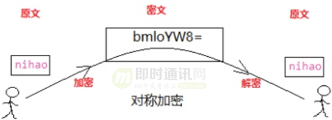
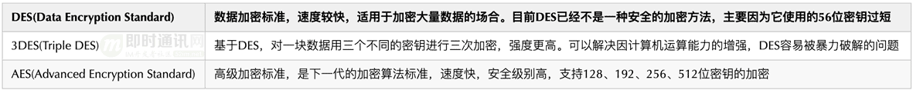
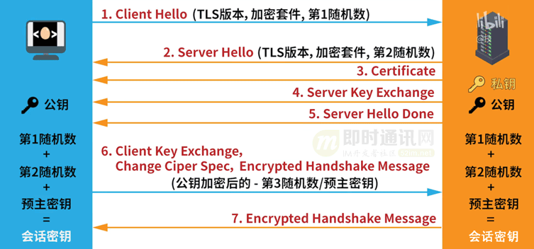
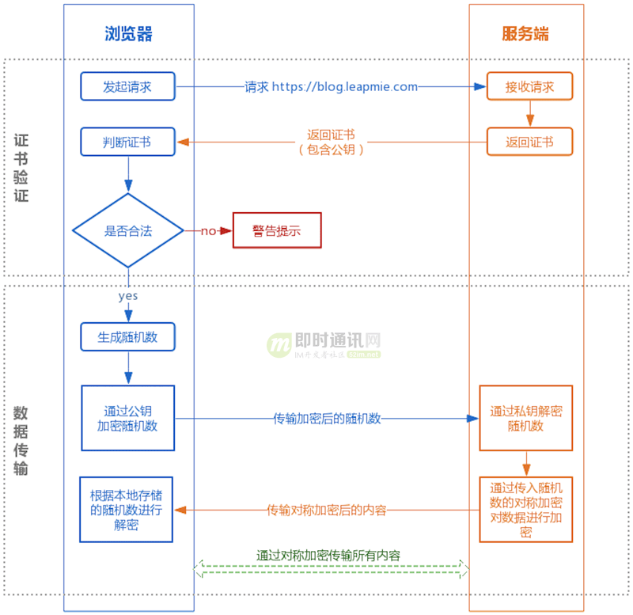

对称加密也称为密钥加密或单向加密，就是使用同一套密钥来进行加密和解密。密钥可以理解为加密算法。

**对称加密图示如下**

**广泛使用的对称加密有：**

**对称加密算法的优缺点和适用场景：**

- ***1）***优点：算法公开、简单，加密解密容易，加密速度快，效率高；
- ***2）***缺点：相对来说不算特别安全，只有一把钥匙，密文如果被拦截，且密钥也被劫持，那么，信息很容易被破译；
- ***3）***适用场景：加解密速度快、效率高，因此适用于大量数据的加密场景。由于如何传输密钥是较为头痛的问题，因此适用于无需进行密钥交换的场景，如内部系统，事先就可以直接确定密钥。

非对称加密使用一对密钥（公钥和私钥）进行加密和解密。

**非对称加密可以在不直接传递密钥的情况下，完成解密，具体步骤如下：**

- ***1）***乙方生成两把密钥（公钥和私钥）。公钥是公开的，任何人都可以获得，私钥则是保密的；
- ***2）***甲方获取乙方的公钥，然后用它对信息加密；
- ***3）***乙方得到加密后的信息，用私钥解密。

**以最典型的非对称加密算法RSA为例，举个例子：**

想要彻底搞懂RSA，需要了解数论的知识，全部推导过程[RSA加密算法](https://www.ruanyifeng.com/blog/2013/07/rsa_algorithm_part_two.html)。简单介绍思路：使用两个超大质数以及其乘积作为生成公钥和私钥的材料，想要从公钥推算出私钥是非常困难的（需要对超大数因式分解为两个很大质数的乘积）。目前被破解的最长RSA密钥是768个二进制位。也就是说，长度超过768位的密钥，还无法破解（至少没人公开宣布）。因此可以认为，1024位的RSA密钥基本安全，2048位的密钥极其安全。

**非对称加密算法的优缺点和适用场景：**

- ***1）***优点：强度高、安全性强于对称加密算法、无需传递私钥导致没有密钥泄露风险；
- ***2）***缺点：计算量大、速度慢；
- ***3）***适用场景：适用于需要密钥交换的场景，如互联网应用，无法事先约定密钥。

**所以说：**HTTPS 并不是一项新的应用层协议，只是 HTTP 通信接口部分由 SSL 和 TLS 替代而已。

**具体就是：**HTTP 会先直接和 TCP 进行通信，而HTTPS 会演变为先和 SSL 进行通信，然后再由 SSL 和 TCP 进行通信。

**SSL是一个独立的协议，不只有 HTTP 可以使用**，其他应用层协议也可以使用，比如FTP、SMTP都可以使用SSL来加密。

- ***1）***用户在浏览器发起HTTPS请求，默认使用服务端的443端口进行连接；
- ***2）***HTTPS需要使用一套**CA 数字证书**，证书内会附带一个服务器的**公钥Pub**，而与之对应的**私钥Private**保留在服务端不公开；
- ***3）***服务端收到请求，返回配置好的包含**公钥Pub**的证书给客户端；
- ***4）***客户端收到**证书**，校验合法性，主要包括是否在有效期内、证书的域名与请求的域名是否匹配，上一级证书是否有效（递归判断，直到判断到系统内置或浏览器配置好的根证书），如果不通过，则显示HTTPS警告信息，如果通过则继续；
- ***5）***客户端生成一个用于对称加密的**随机Key**，并用证书内的**公钥Pub**进行加密，发送给服务端；
- ***6）***服务端收到**随机Key**的密文，使用与**公钥Pub**配对的**私钥Private**进行解密，得到客户端真正想发送的**随机Key**；
- ***7）***服务端使用客户端发送过来的**随机Key**对要传输的HTTP数据进行对称加密，将密文返回客户端；
- ***8）***客户端使用**随机Key**对称解密密文，得到HTTP数据明文；
- ***9）***后续HTTPS请求使用之前交换好的**随机Key**进行对称加解密。

大家可能都听说过 HTTPS 协议之所以是安全的是因为 HTTPS 协议会对传输的数据进行加密，而加密过程是使用了非对称加密实现。但其实：HTTPS 在内容传输的加密上使用的是对称加密，非对称加密只作用在证书验证阶段。

## 为什么数据传输是用对称加密？

**首先：**非对称加密的加解密效率是非常低的，而 http 的应用场景中通常端与端之间存在大量的交互，非对称加密的效率是无法接受的。

**另外：**在 HTTPS 的场景中只有服务端保存了私钥，一对公私钥只能实现单向的加解密，所以 HTTPS 中内容传输加密采取的是对称加密，而不是非对称加密。

## 浏览器是如何确保 CA 证书的合法性？

### 7.1证书包含什么信息？

- 1）颁发机构信息；
- 2）公钥；
- 3）公司信息；
- 4）域名；
- 5）有效期；
- 6）指纹；
- 7）......

### 7.2证书的合法性依据是什么？

- 1）首先：权威机构是要有认证的，不是随便一个机构都有资格颁发证书，不然也不叫做权威机构；
- 2）另外：证书的可信性基于信任制，权威机构需要对其颁发的证书进行信用背书，只要是权威机构生成的证书，我们就认为是合法的。

所以权威机构会对申请者的信息进行审核，不同等级的权威机构对审核的要求也不一样，于是证书也分为免费的、便宜的和贵的。