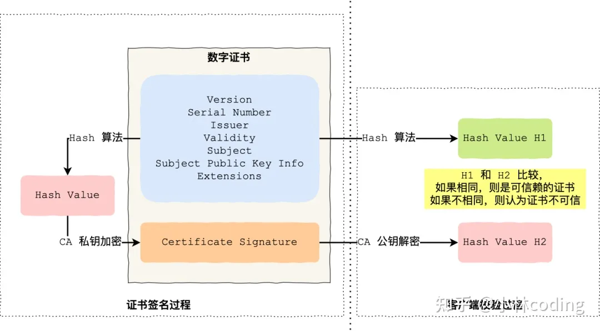

#### HTTPS握手过程

1. 客户端发出请求（ClientHello）： 客户端向服务端发起加密通信的请求
2. 服务器回应（SeverHello）： 服务器收到客户端请求后，确认加密通信协议版本是否一致，如果版本一致则返回服务器证书，否则关闭加密通信
3. 客户端回应：客户端收到服务器回应后，客户端首先验证证书是否有效。如果证书失效，则会给访问者一个警示，由其决定是否继续连接。如果证书没失效，则使用证书中的公钥加密一个随机数(pre-master key)返回给服务器，同时返回客户端握手结束通知。
4. 服务器的最后回应：服务器收到客户端发来的pre-master key后，计算生成本次会话的“会话密钥”，向客户端发送服务器握手结束通知。
    整个握手阶段结束。接下来，客户端与服务器进入加密通信。

#### 

#### 客户端如何验证证书的合法性

1. 首先浏览器读取证书中的证书所有者、有效期等信息进行校验，校验证书的网站域名是否与证书颁发的域名一致，校验证书是否在有效期内
2. 浏览器开始查找操作系统中已内置的受信任的证书发布机构CA，与服务器发来的证书中的颁发者CA比对，用于校验证书是否为合法机构颁发
3. 如果找不到，浏览器就会报错，说明服务器发来的证书是不可信任的。
4. 如果找到，那么浏览器就会从操作系统中取出颁发者CA 的公钥(多数浏览器开发商发布
    版本时，会事先在内部植入常用认证机关的公开密钥)，然后对服务器发来的证书里面的签名进行解密
5. 浏览器使用相同的hash算法计算出服务器发来的证书的hash值，将这个计算的hash值与证书中签名做对比
6. 对比结果一致，则证明服务器发来的证书合法，没有被冒充

作者：小林coding
链接：https://www.zhihu.com/question/37370216/answer/1914075935
来源：知乎
著作权归作者所有。商业转载请联系作者获得授权，非商业转载请注明出处。

### **数字证书和 CA 机构**

在说校验数字证书是否可信的过程前，我们先来看看数字证书是什么，一个数字证书通常包含了：

- 公钥；
- 持有者信息；
- 证书认证机构（CA）的信息；
- CA 对这份文件的数字签名及使用的算法；
- [证书有效期](https://www.zhihu.com/search?q=证书有效期&search_source=Entity&hybrid_search_source=Entity&hybrid_search_extra={"sourceType"%3A"answer"%2C"sourceId"%3A1914075935})；
- 还有一些其他额外信息；

那数字证书的作用，是用来认证公钥持有者的身份，以防止第三方进行冒充。说简单些，证书就是用来告诉客户端，该服务端是否是合法的，因为只有证书合法，才代表服务端身份是可信的。

我们用证书来认证公钥持有者的身份（服务端的身份），那证书又是怎么来的？又该怎么认证证书呢？

为了让服务端的公钥被大家信任，服务端的证书都是由 CA （*Certificate Authority*，证书认证机构）签名的，CA 就是网络世界里的公安局、公证中心，具有极高的可信度，所以由它来给各个公钥签名，信任的一方签发的证书，那必然证书也是被信任的。

之所以要签名，是因为签名的作用可以避免中间人在获取证书时对证书内容的篡改。

### **数字证书签发和验证流程**

如下图图所示，为数字证书签发和验证流程：

CA 签发证书的过程，如上图左边部分：

- 首先 CA 会把持有者的公钥、用途、颁发者、有效时间等信息打成一个包，然后对这些信息进行 Hash 计算，得到一个 Hash 值；
- 然后 CA 会使用自己的私钥将该 Hash 值加密，生成 Certificate Signature，也就是 CA 对证书做了签名；
- 最后将 Certificate Signature 添加在文件证书上，形成数字证书；

客户端校验服务端的数字证书的过程，如上图右边部分：

- 首先客户端会使用同样的 Hash 算法获取该证书的 Hash 值 H1；
- 通常浏览器和操作系统中集成了 CA 的[公钥信息](https://www.zhihu.com/search?q=公钥信息&search_source=Entity&hybrid_search_source=Entity&hybrid_search_extra={"sourceType"%3A"answer"%2C"sourceId"%3A1914075935})，浏览器收到证书后可以使用 CA 的[公钥解密](https://www.zhihu.com/search?q=公钥解密&search_source=Entity&hybrid_search_source=Entity&hybrid_search_extra={"sourceType"%3A"answer"%2C"sourceId"%3A1914075935}) Certificate Signature 内容，得到一个 Hash 值 H2 ；
- 最后比较 H1 和 H2，如果值相同，则为可信赖的证书，否则则认为证书不可信。

### **[证书链](https://www.zhihu.com/search?q=证书链&search_source=Entity&hybrid_search_source=Entity&hybrid_search_extra={"sourceType"%3A"answer"%2C"sourceId"%3A1914075935})**

但事实上，证书的验证过程中还存在一个证书信任链的问题，因为我们向 CA 申请的证书一般不是根证书签发的，而是由中间证书签发的，比如百度的证书，从下图你可以看到，证书的层级有三级：

对于这种三级层级关系的证书的验证过程如下：

- 客户端收到 [http://baidu.com](https://link.zhihu.com/?target=http%3A//baidu.com) 的证书后，发现这个证书的签发者不是根证书，就无法根据本地已有的根证书中的公钥去验证 [http://baidu.com](https://link.zhihu.com/?target=http%3A//baidu.com) 证书是否可信。于是，客户端根据 [http://baidu.com](https://link.zhihu.com/?target=http%3A//baidu.com) 证书中的签发者，找到该证书的颁发机构是 “GlobalSign Organization Validation CA - SHA256 - G2”，然后向 CA 请求该[中间证书](https://www.zhihu.com/search?q=中间证书&search_source=Entity&hybrid_search_source=Entity&hybrid_search_extra={"sourceType"%3A"answer"%2C"sourceId"%3A1914075935})。
- 请求到证书后发现 “GlobalSign Organization Validation CA - SHA256 - G2” 证书是由 “GlobalSign Root CA” 签发的，由于 “GlobalSign Root CA” 没有再上级签发机构，说明它是根证书，也就是自签证书。应用软件会检查此证书有否已预载于[根证书](https://www.zhihu.com/search?q=根证书&search_source=Entity&hybrid_search_source=Entity&hybrid_search_extra={"sourceType"%3A"answer"%2C"sourceId"%3A1914075935})清单上，如果有，则可以利用根证书中的公钥去验证 “GlobalSign Organization Validation CA - SHA256 - G2” 证书，如果发现验证通过，就认为该中间证书是可信的。
- “GlobalSign Organization Validation CA - SHA256 - G2” 证书被信任后，可以使用 “GlobalSign Organization Validation CA - SHA256 - G2” 证书中的公钥去验证 [http://baidu.com](https://link.zhihu.com/?target=http%3A//baidu.com) 证书的可信性，如果验证通过，就可以信任 [http://baidu.com](https://link.zhihu.com/?target=http%3A//baidu.com) 证书。

在这四个步骤中，最开始客户端只信任根证书 GlobalSign Root CA 证书的，然后 “GlobalSign Root CA” 证书信任 “GlobalSign Organization Validation CA - SHA256 - G2” 证书，而 “GlobalSign Organization Validation CA - SHA256 - G2” 证书又信任 [http://baidu.com](https://link.zhihu.com/?target=http%3A//baidu.com) 证书，于是客户端也信任 [http://baidu.com](https://link.zhihu.com/?target=http%3A//baidu.com) 证书。

总括来说，由于用户信任 GlobalSign，所以由 GlobalSign 所担保的 [http://baidu.com](https://link.zhihu.com/?target=http%3A//baidu.com) 可以被信任，另外由于用户信任操作系统或浏览器的软件商，所以由软件商预载了根证书的 GlobalSign 都可被信任。

操作系统里一般都会内置一些根证书，比如我的 MAC 电脑里内置的根证书有这么多：

这样的一层层地验证就构成了一条[信任链路](https://www.zhihu.com/search?q=信任链路&search_source=Entity&hybrid_search_source=Entity&hybrid_search_extra={"sourceType"%3A"answer"%2C"sourceId"%3A1914075935})，整个证书信任链验证流程如下图所示：

最后一个问题，为什么需要证书链这么麻烦的流程？Root CA 为什么不直接颁发证书，而是要搞那么多[中间层级](https://www.zhihu.com/search?q=中间层级&search_source=Entity&hybrid_search_source=Entity&hybrid_search_extra={"sourceType"%3A"answer"%2C"sourceId"%3A1914075935})呢？

这是为了确保根证书的绝对安全性，将根证书隔离地越严[格越](https://www.zhihu.com/search?q=格越&search_source=Entity&hybrid_search_source=Entity&hybrid_search_extra={"sourceType"%3A"answer"%2C"sourceId"%3A1914075935})好，不然根证书如果失守了，那么整个信任链都会有问题。