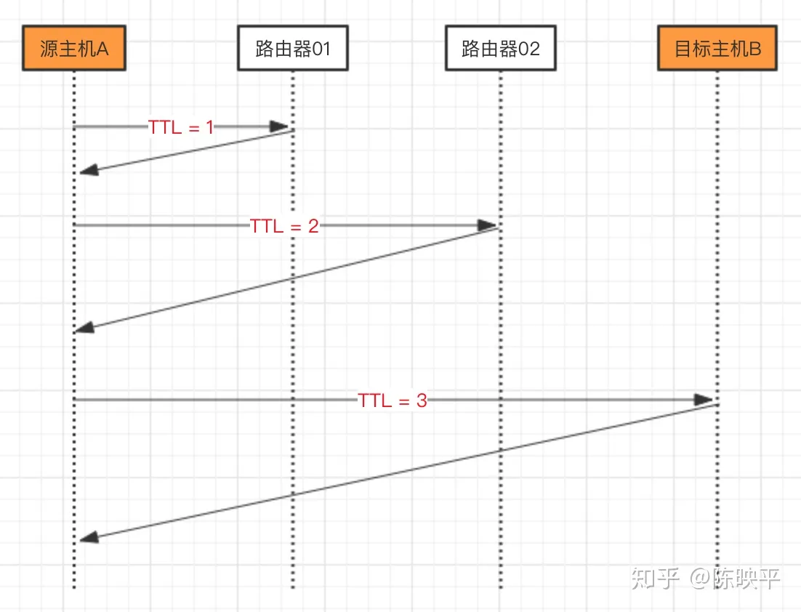
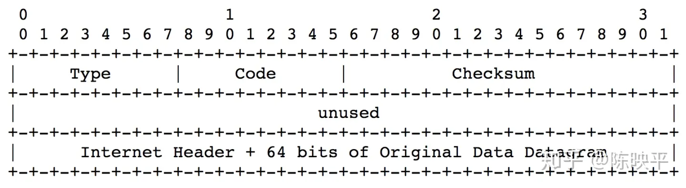

假设想要知道，当我们访问 [http://www.iqiyi.com](https://link.zhihu.com/?target=http%3A//www.iqiyi.com) 时，经过了多少中间节点，那么可以采用如下命令：

```bash
traceroute www.iqiyi.com
```


以下是输出结果（osx下，为节省篇幅，省略部分输出结果），后面会对输出结果进行讲解。

```bash
traceroute: Warning: www.iqiyi.com has multiple addresses; using 121.9.221.96
traceroute to static.dns.iqiyi.com (121.9.221.96), 64 hops max, 52 byte packets
 1  xiaoqiang (192.168.31.1)  1.733 ms  1.156 ms  1.083 ms
 2  192.168.1.1 (192.168.1.1)  2.456 ms  1.681 ms  1.429 ms
 # ... 忽略部分输出结果
 9  121.9.221.96 (121.9.221.96)  6.607 ms  9.049 ms  6.706 ms
```


首先，域名 [http://www.iqiyi.com](https://link.zhihu.com/?target=http%3A//www.iqiyi.com) 对应多个IP地址，这里采用了其中一个IP地址 121.9.221.96，对应的主机名是 [http://static.dns.iqiyi.com](https://link.zhihu.com/?target=http%3A//static.dns.iqiyi.com)。

从当前主机，到目标主机，最多经过64跳（64 hops max），每次检测发送的包大小为52字节（52 byte packets）

```bash
traceroute: Warning: www.iqiyi.com has multiple addresses; using 121.9.221.96
traceroute to static.dns.iqiyi.com (121.9.221.96), 64 hops max, 52 byte packets
```


接下来的输出比较有规律。每一行包含三部分：序号 + 主机 + 耗时。

行首是序号，表示这是经过的第N个中间节点。序号后面是节点的主机名+IP地址。最后是到达节点所耗费的时间。

```bash
1  xiaoqiang (192.168.31.1)  1.733 ms  1.156 ms  1.083 ms
2  192.168.1.1 (192.168.1.1)  2.456 ms  1.681 ms  1.429 ms
```

> 注意，每次检测都同时发送3个数据包，因此打印出来三个时间。此外，如果某一个数据报超时没有返回，则时间显示为 *，此时需要特别注意，因为有可能出问题了。


以第1跳为例（家里的路由器），主机名是 xiaoqiang，IP地址是 192.168.31.1，检测数据包到达路由器的时间分别是 1.733 ms 1.156 ms 1.083 ms。

```text
1  xiaoqiang (192.168.31.1)  1.733 ms  1.156 ms  1.083 ms
```


第2、3 ... N 跳类似，最后一跳为目标主机。

```bash
9  121.9.221.96 (121.9.221.96)  6.607 ms  9.049 ms  6.706 ms
```


## 实现原理简析

主机之间通信，网络层IP数据报的首部中，有个TTL字段(Time To Live)。TTL的作用是，设置IP数据报被丢弃前，最多能够经过的节点数。

此外，每经过一个中间节点，再向下一个节点转发数据前，都会将TTL减1。如果TTL不为0，则将数据报转发到下一个节点；否则，丢弃数据报，并返回错误。

假设TTL设置为N，当前转发到第M个节点：

- 第1个节点：将TTL设置为N-1。如果TTL != 0，则将数据报传递给第2个节点；否则丢弃数据报，并向源主机报错。
- 第2个节点：将TTL设置为N-2。如果TTL != 0，则将数据报传递给第3个节点；否则丢弃数据报，并向源主机报错。
- 。。。
- 第M个节点：将TTL设置为N-M。如果TTL != 0，则将数据报传递给第3个节点；否则丢弃数据报，并向源主机报错。
- 。。。


如果源主机收到出错的回报，则知道数据报已经到达第M个节点。此时，记录下第M个节点的IP，以及数据报往返的耗时。

到这里，可以引出traceroute的实现原理（非严谨）：

```text
从源主机向目标主机发送IP数据报，并按顺序将TTL设置为从1开始递增的数字（假设为N），导致第N个节点（中间节点 or 目标主机）丢弃数据报并返回出错信息。源主机根据接收到的错误信息，确定到达目标主机路径上的所有节点的IP，以及对应的耗时。
```


来个简单的图例。假设源主机A到目标主机B之间有2个中间节点，也就是说，A到B一共需要经过3跳。那么，traceroute的检测时序如下：




## 实现原理深入剖析

前面简单阐述了traceroute的实现原理，下面进一步介绍实现细节。这里主要回答3个问题：

1. 问题一：传输层采用的是UDP，还是TCP？
2. 问题二：当TTL为0时，接收节点会丢弃接数据报，并向源主机报错。这里的报错信息是什么？
3. 问题三：假设到达目标主机一共有N跳，且TTL刚好设置为N，那么，目标主机成功收到数据报，此时并没有错误回报，traceroute如何确定已经到达目标主机？


## 问题一：UDP还是TCP

答案是UDP。为什么呢？读者同学可以想一下。


## 问题二：报错信息是什么

这里的报错信息是ICMP（Internet Control Message Protocol）报文，它用于在主机、路由之间传递控制信息。

上面的定义有点难理解。简答的来讲，就是两台主机之间约定的暗号，用来告诉对方一些事情，比如“您访问的主机不存在”之类的。

如下所示，ICMP数据报是封装在IP数据报中进行传递的。（此时，IP数据报首部的协议字段设置为1，表示当前传递的是ICMP报文。）


ICMP报文通用格式如下，主要关注Type、Code两个字段。

- Type字段：ICMP报文类型。比如超时错误（Time Exceeded Message）、目标主机不可达错误（Destination Unreachable Message）等。
- Code字段：子类型。比如，导致目标主机不可达错误的原因可能有多种，比如主机错误（code=1），端口错误（code=3）等。




IP数据报未到达目标主机，且TTL被置为0时，返回的就是超时错误（Time Exceeded Message），此时Type=11，code=0。

traceroute收到ICMP报文，发现Type=11，code=0，记录下发送节点的IP和耗时。


## 问题三：报文是否到达目标主机

文章开头的图，假设TTL设置为大于3的数，此时IP数据报安全抵达目标主机B，并没有发生超时错误。这种情况下，traceroute如何知道已经到达了目标主机？


先来回顾下UPD用户数据报的首部（非完整），它包含了源端口、目标端口。


traceroute发送UDP报文时，将目标端口设置为较大的值（ 33434 - 33464），避免目标主机B上该端口有在实际使用。

当报文到达目标主机B，目标主机B发现目标端口不存在，则向源主机A发送ICMP报文（Type=3，Code=3），表示目标端口不可达。

源主机A收到差错报文，发现Type=3，Code=3，知道已经到达目标主机B。记录下IP、耗费，检测结束。