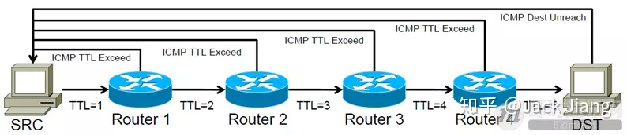

ping 命令会发送一份ICMP回显请求报文给目标主机，并等待目标主机返回ICMP回显应答。因为ICMP协议会要求目标主机在收到消息之后，必须返回ICMP应答消息给源主机，如果源主机在一定时间内收到了目标主机的应答，则表明两台主机之间网络是可达的。

**举一个例子来描述「ping」命令的工作过程：**

**1）**假设有两个主机，主机A（192.168.0.1）和主机B（192.168.0.2），现在我们要监测主机A和主机B之间网络是否可达，那么我们在主机A上输入命令：ping 192.168.0.2；

**2）**此时，ping命令会在主机A上构建一个 ICMP的请求数据包（数据包里的内容后面再详述），然后 ICMP协议会将这个数据包以及目标IP（192.168.0.2）等信息一同交给IP层协议；

**3）**IP层协议得到这些信息后，将源地址（即本机IP）、目标地址（即目标IP：192.168.0.2）、再加上一些其它的控制信息，构建成一个IP数据包；

**4）**IP数据包构建完成后，还不够，还需要加上MAC地址，因此，还需要通过ARP映射表找出目标IP所对应的MAC地址。当拿到了目标主机的MAC地址和本机MAC后，一并交给数据链路层，组装成一个数据帧，依据以太网的介质访问规则，将它们传送出出去；

**5）**当主机B收到这个数据帧之后，会首先检查它的目标MAC地址是不是本机，如果是就接收下来处理，接收之后会检查这个数据帧，将数据帧中的IP数据包取出来，交给本机的IP层协议，然后IP层协议检查完之后，再将ICMP数据包取出来交给ICMP协议处理，当这一步也处理完成之后，就会构建一个ICMP应答数据包，回发给主机A；

**6）**在一定的时间内，如果主机A收到了应答包，则说明它与主机B之间网络可达，如果没有收到，则说明网络不可达。除了监测是否可达以外，还可以利用应答时间和发起时间之间的差值，计算出数据包的延迟耗时。

通过ping的流程可以发现，ICMP协议是这个过程的基础，是非常重要的，下面的章节会把ICMP协议再详细解释一下，请继续往下读。

## 4、正确理解ICMP协议

**Ping命令所基于的ICMP协议所处的网络模型层级：**

（▲ 上图来自《[计算机网络通讯协议关系图（中文珍藏版）[附件下载\]](https://link.zhihu.com/?target=http%3A//www.52im.net/thread-180-1-1.html)》，您可下载此图的完整清晰版）

Ping命令这么简单，在任何系统上上手就能使用，很多人可能想当然的认为Ping命令使用的ICMP协议应该是基于传输层的TCP或UDP协议的吧。

正如上图所示，ICMP协议既不是基于TCP，也不是基于UDP，而是直接基于网络层的IP协议，在整个网络协议栈中属于相当底层的协议了。这也从侧面证明了它的重要性，因为根据ICMP的[RFC手册](https://link.zhihu.com/?target=https%3A//tools.ietf.org/html/rfc792)规定：ICMP协议是任何支持IP协议的系统必须实现的，没有余地。而IP协议是整个互联网的基石，ICMP协议虽简单，但重要性不言而喻。

我们知道，ping命令是基于ICMP协议来实现的。那么我们再来看下图，就明白了ICMP协议又是通过IP协议来发送的，即ICMP报文是封装在IP包中（如下图所示）。

IP协议是一种无连接的，不可靠的数据包协议，它并不能保证数据一定被送达，那么我们要保证数据送到就需要通过其它模块来协助实现，这里就引入的是ICMP协议。

当传送的IP数据包发送异常的时候，ICMP就会将异常信息封装在包内，然后回传给源主机。

**将上图再细拆一下可见：**

**继续将ICMP协议模块细拆:**

由图可知，ICMP数据包由8bit的类型字段和8bit的代码字段以及16bit的校验字段再加上选项数据组成。

**ICMP协议大致可分为两类：**

1）查询报文类型；

2）差错报文类型。

***【关于查询报文类型】：\***

查询报文主要应用于：ping查询、子网掩码查询、时间戳查询等等。

上面讲到的ping命令的流程其实就对应ICMP协议查询报文类型的一种使用。在主机A构建ICMP请求数据包的时候，其ICMP的类型字段中使用的是 8 （回送请求），当主机B构建ICMP应答包的时候，其ICMP类型字段就使用的是 0 （回送应答），更多类型值参考上表。

对 查询报文类型 的理解可参考一下文章最开始讲的ping流程，这里就不做赘述。

***【关于差错报文类型】：***

差错报文主要产生于当数据传送发送错误的时候。

它包括：目标不可达（网络不可达、主机不可达、协议不可达、端口不可达、禁止分片等）、超时、参数问题、重定向（网络重定向、主机重定向等）等等。

差错报文通常包含了引起错误的IP数据包的第一个分片的IP首部，加上该分片数据部分的前8个字节。

当传送IP数据包发生错误的时候（例如 主机不可达），ICMP协议就会把错误信息封包，然后传送回源主机，那么源主机就知道该怎么处理了。

## 6、ICMP差错报文的妙用

正如上一节所介绍的那样，ICMP协议主要有：查询报文类型和差错报文类型两种。对于差错报文来说，是不是只有遇到错误的时候才能使用呢？不是！

基于这个特性，Linux下的Traceroute指令（Windows下的对等指令是tracert）利于ICMP的差错报文可以实现遍历到数据包传输路径上的所有路由器！这真是个有用的命令！

**百度百科上关于traceroute命令的用途：**

> traceroute (Windows 系统下是tracert) 命令利用ICMP 协议定位您的计算机和目标计算机之间的所有路由器。TTL 值可以反映数据包经过的路由器或网关的数量，通过操纵独立ICMP 呼叫报文的TTL 值和观察该报文被抛弃的返回信息，traceroute命令能够遍历到数据包传输路径上的所有路由器。

ICMP的差错报文的使用，使得Traceroute成为用来侦测源主机到目标主机之间所经过路由情况的常用工具。Traceroute 的原理就是利用ICMP的规则，制造一些错误的事件出来，然后根据错误的事件来评估网络路由情况。

**traceroute的基本原理如下图所示：**

**具体做法就是：**

**1）**Traceroute会设置特殊的TTL值，来追踪源主机和目标主机之间的路由数。首先它给目标主机发送一个 TTL=1 的UDP数据包，那么这个数据包一旦在路上遇到一个路由器，TTL就变成了0（TTL规则是每经过一个路由器都会减1），因为TTL=0了，所以路由器就会把这个数据包丢掉，然后产生一个错误类型（超时）的ICMP数据包回发给源主机，也就是差错包。这个时候源主机就拿到了第一个路由节点的IP和相关信息了；

**2）**接着，源主机再给目标主机发一个 TTL=2 的UDP数据包，依旧上述流程走一遍，就知道第二个路由节点的IP和耗时情况等信息了；

**3）**如此反复进行，Traceroute就可以拿到从主机A到主机B之间所有路由器的信息了。

但是有个问题是，如果数据包到达了目标主机的话，即使目标主机接收到TTL值为1的IP数据包，它也是不会丢弃该数据包的，也不会产生一份超时的ICMP回发数据包的，因为数据包已经达到了目的地嘛。那我们应该怎么认定数据包是否达到了目标主机呢？

Traceroute的方法是在源主机发送UDP数据包给目标主机的时候，会设置一个不可能达到的目标端口号（例如大于30000的端口号），那么当这个数据包真的到达目标主机的时候，目标主机发现没有对应的端口号，因此会产生一份“端口不可达”的错误ICMP报文返回给源主机。